```{=latex}
\raggedbottom
```

```{r}
#| include: false
composition_results <- targets::tar_read(s23_summary, store = "../_targets")
constraint_results <- targets::tar_read(s24_summary, store = "../_targets")
rcpd_comparison <- targets::tar_read(s29_summary, store = "../_targets")
projection_audit <- targets::tar_read(s31_summary, store = "../_targets")
bank_stress <- targets::tar_read(s32_summary, store = "../_targets")
california_results <- targets::tar_read(s33_summary, store = "../_targets")
california_audit <- targets::tar_read(s33_audit, store = "../_targets")

fmt <- function(x, digits = 3L) formatC(x, format = "f", digits = digits)
s29_value <- function(method, variable) {
  rcpd_comparison$metrics[
    rcpd_comparison$metrics$method == method, variable, drop = TRUE
  ]
}
s31_value <- function(bound, audit_size, variable) {
  projection_audit[
    projection_audit$bound == bound &
      projection_audit$audit_size == audit_size,
    variable,
    drop = TRUE
  ]
}
s32_distance <- function(method) {
  bank_stress$sensitivity$centered_sup_distance[
    bank_stress$sensitivity$method == method
  ]
}
s33_value <- function(model, learner, epsilon, variable) {
  california_results[
    california_results$model == model &
      california_results$learner == learner &
      california_results$epsilon == epsilon,
    variable,
    drop = TRUE
  ]
}
s33_endpoint <- function(model, learner, method, epsilon = 0.15) {
  raw <- s33_value(
    model, learner, epsilon, paste0("median_", method, "_endpoint")
  )
  normalized <- s33_value(
    model, learner, epsilon,
    paste0("median_", method, "_endpoint_normalized")
  )
  sprintf("%.3f (%.3f)", raw, normalized)
}
s33_audit_value <- function(learner, variable, epsilon = 0.15) {
  california_audit[
    california_audit$learner == learner &
      california_audit$epsilon == epsilon,
    variable,
    drop = TRUE
  ]
}
s24_value <- function(reference, variable) {
  constraint_results$diagnostics[
    constraint_results$diagnostics$reference == reference,
    variable,
    drop = TRUE
  ]
}
```

## Introduction {#sec-introduction}

Partial dependence (PD) averages a fitted prediction function after replacing a
focal feature by a value $z$ [@friedman2001]. With dependent predictors, this
operation can evaluate the model at rare or absent feature combinations
[@apley2020; @hooker2021]. The usual warning that PD may extrapolate leaves two
questions unresolved: how much of each induced query distribution is accepted
by a declared support rule, and which population is represented after invalid
queries are removed.

These questions matter because the obvious remedy, pointwise trimming, changes
the context population with $z$. The resulting curve can mix changes in model
response with changes in who remains in the average. ALE avoids global feature
replacement by accumulating local differences [@apley2020], while subgroup and
regional methods deliberately construct local populations
[@herbinger2022; @molnar2024]. They answer useful but different questions. We
consider settings in which a global model-query contrast must use one unchanged
reference population across a declared intervention range.

Our contribution is a common-reference formulation of that problem. First,
interventional support coverage (ISC) audits ordinary-PD queries and connects
rejected mass to sharp robustness envelopes over admissible extensions. Second, hard
common-support PD and a relaxed common-reference PD (RCPD) separate response
shape from changing composition. RCPD is the classical KL information
projection [@csiszar1975; @csiszar2003] under one validity constraint per grid
point; the contribution is the estimand and constraint formulation, not a new
convex optimizer. Third, an independent audit split converts a predeclared
finite family of fitted tilts into a simultaneous finite-sample validity
certificate with explicit abstention. The concentration tool is standard; its
use here closes the gap between same-sample projection constraints and
population query validity.

This scope is narrower than a general correction of PD. A validity rule is a
declared operational notion of query compatibility, not causal overlap or a
guarantee of model accuracy. CSPD and RCPD change the reference population and
must be reported with their information distortion and effective sample size.
The empirical study therefore asks when that declared population change alters
the fitted interpretation and when it merely records a support warning.

## Relation to conditional effects and balancing weights {#sec-related}

RCPD sits between two mature literatures but has a different target from both.
Dependence-aware feature-effect methods primarily change the functional being
displayed. Conditional PD averages under $P(X_{-j}\mid X_j=z)$ and therefore
lets the context distribution vary with $z$; it describes the fitted model
through the observed conditional distribution and can mix the focal response
with effects of correlated features [@apley2020; @molnar2024]. Conditional-
subgroup PDPs instead report several local curves, one for each interpretable
partition of the context space [@molnar2024]. ALE accumulates local prediction
differences rather than averaging one fixed intervention distribution
[@apley2020]. These are valuable conditional or local descriptions, but none is
one global intervention curve over an unchanged population.

Query plausibility and robustness also have direct precedents. Practical PDP
software uses rug marks and bivariate convex-hull restriction to discourage
interpretation away from observed data [@greenwell2017]. @yeh2021 downweight
out-of-distribution ICE queries when constructing an ICE-derived feature-impact
measure, while @baniecki2024 bound changes in PD and ALE under data or model
perturbations. These methods respectively modify the displayed grid, an
ICE-derived summary, or the perturbation question; they do not construct one
support-qualified reference distribution used unchanged over an intervention
range. A weighted PD average is itself routine. The contribution here is the
estimand and the simultaneous query-validity rule that determine its weights.

The optimization is equally close to calibration and balancing methodology.
Survey calibration, entropy balancing, empirical-likelihood tilting, and
minimal-dispersion weights choose low-dispersion weights subject to moment or
covariate-balance restrictions [@deville1992; @kitamura1997; @hainmueller2012;
@li2018; @wang2020]. RCPD deliberately reuses that geometry. Its constraints,
however, are not covariate moments imported from a treatment group or external
target population. They are the $K$ model-query validity indicators
$h_k(U)$, and the target distribution is defined endogenously as the
KL-nearest distribution to the original contexts that makes every declared PD
query sufficiently valid. The weights depend on $P$, the validity rule,
$G$, and $\epsilon$, but not on the prediction values $f(z,U)$.

| Approach | Population represented | Distinguishing feature |
|:--|:--|:--|
| Ordinary PD | One marginal context population | No query-validity restriction |
| Conditional PD | $P(X_{-j}\mid X_j=z)$ | Population changes with $z$ |
| Conditional-subgroup PD | One population per learned subgroup | Returns several local curves |
| Geometric/OOD guards | Grid restriction or query-specific weighting | No common projected reference population |
| Entropy/calibration balancing | A sample calibrated to external moments or a causal target | Constraints encode covariate balance |
| RCPD | One KL-nearest context population for all $z\in G$ | Constraints encode simultaneous PD-query validity |

: Estimand-level comparison with the closest dependence-aware and weighting approaches. {#tbl-related-work}

## Support-qualified feature effects {#sec-method}

### Query validity and reference populations

Let $X=(X_j,X_{-j})$, let $P=P_{X_{-j}}$ be the original context distribution,
and let $f$ be a fitted prediction function. Ordinary PD is
$$\operatorname{PD}_j(z)=\mathbb E_P[f(z,X_{-j})].$$ {#eq-pd}
Let $s_j(z,u)$ be a prespecified validity score, with accepted queries
$\mathcal V=\{(z,u):s_j(z,u)\leq t\}$. The score, threshold, feature scaling,
and intervention range are part of the estimand. Conditional residual or
density scores ask whether $z$ is compatible with a context $u$; joint scores
also react to marginally rare contexts.

For any reference distribution $R$, define
$$
\operatorname{ISC}_j^R(z)
=R\{u:(z,u)\in\mathcal V\}.
$$ {#eq-isc}
Thus $\operatorname{ISC}_j^P(z)$ audits the exact query distribution used by
ordinary PD. If $f\in[y_-,y_+]$ and is trusted only on accepted queries, put
$m_{\mathcal V}(z)=\mathbb E_P[f(z,X_{-j})\mathbf 1\{(z,X_{-j})\in\mathcal V\}]$
and use the algebraic complement
$\operatorname{PER}_j(z)=1-\operatorname{ISC}_j^P(z)$. Ordinary PD of the
fully specified fitted function is, of course, directly computable. The
uncertainty here is a robustness question: how much could its value change if
predictions at rejected queries were replaced by another admissible extension?
For fixed $z$, define
$$
\mathcal A_z(f)=\{\widetilde f:\widetilde f(z,u)=f(z,u)
\text{ on }\mathcal V_z,\ y_-\leq\widetilde f(z,u)\leq y_+\},
\qquad \mathcal V_z=\{u:(z,u)\in\mathcal V\}.
$$ {#eq-extension-class}
The sharp range-only robustness envelope
$\{\mathbb E_P[\widetilde f(z,X_{-j})]:\widetilde f\in\mathcal A_z(f)\}$ has
endpoints
$$
\inf_{\widetilde f\in\mathcal A_z(f)}\mathbb E_P\widetilde f(z,X_{-j})
=m_{\mathcal V}(z)+y_-\operatorname{PER}_j(z),\qquad
\sup_{\widetilde f\in\mathcal A_z(f)}\mathbb E_P\widetilde f(z,X_{-j})
=m_{\mathcal V}(z)+y_+\operatorname{PER}_j(z).
$$ {#eq-range-bounds}
Sharper Lipschitz envelopes are given in the online supplement; they retain
ordinary PD as the estimand rather than replacing its reference population.

For a finite grid $G$, define the contexts valid everywhere and their mass by
$$
\mathcal C_j(G)=\bigcap_{z\in G}\{u:(z,u)\in\mathcal V\},
\qquad \gamma_j(G)=P\{\mathcal C_j(G)\}.
$$ {#eq-common-set}
When $\gamma_j(G)>0$, hard common-support PD is
$$
\operatorname{CSPD}_j(z;G)=
\mathbb E_P[f(z,X_{-j})\mid X_{-j}\in\mathcal C_j(G)].
$$ {#eq-cspd}
It uses one fully accepted population over the entire grid but can be unstable
when $\gamma_j(G)$ is small. Pointwise-trimmed PD instead conditions on
$\{u:(z,u)\in\mathcal V\}$ separately at every $z$; it is a moving-reference
curve and is reported as such.

### Relaxed common reference

For tolerance $\epsilon\in[0,1)$, let
$h_k(u)=\mathbf 1\{(z_k,u)\in\mathcal V\}$ for $G=\{z_1,\ldots,z_K\}$ and
define
$$
Q_\epsilon^*
=\arg\min_{Q\ll P}D_{\mathrm{KL}}(Q\Vert P)
\quad\text{subject to}\quad
\mathbb E_Q h_k\geq1-\epsilon,\quad k=1,\ldots,K.
$$ {#eq-relaxed-projection}
The resulting curve is
$$
\operatorname{RCPD}_{j,\epsilon}(z;G)
=\mathbb E_{Q_\epsilon^*}[f(z,U)].
$$ {#eq-rcpd}

```{=latex}
\begin{proposition}[Relaxed common-reference projection]
\label{prop-relaxed-reference}
```
If @eq-relaxed-projection is feasible with finite KL and admits a strictly
feasible point, its minimizer is unique and has density
$$
\frac{dQ_\epsilon^*}{dP}(u)
=\frac{\exp\{\lambda^{*\top}h(u)\}}
 {\mathbb E_P\exp\{\lambda^{*\top}h(U)\}},
\qquad \lambda^*\geq0,
$$ {#eq-exponential-tilt}
where $\lambda^*$ minimizes
$$
\log\mathbb E_P\exp\{\lambda^\top h(U)\}
-(1-\epsilon)\mathbf 1^\top\lambda.
$$ {#eq-dual}
If $P$ already satisfies the constraints, $Q_\epsilon^*=P$. When
$\gamma_j(G)>0$, $Q_\epsilon^*$ converges to
$P(\,\cdot\mid\mathcal C_j(G))$ as $\epsilon\downarrow0$.
```{=latex}
\end{proposition}
```

This is a standard I-projection onto linear moment inequalities. It supplies a
graded validity--fidelity frontier: smaller $\epsilon$ raises validity but can
increase KL cost, maximum weight, and variance. Every analysis therefore
reports minimum projected validity, $D_{\mathrm{KL}}(Q_\epsilon^*\Vert P)$,
effective sample size $1/\sum_iw_i^2$, and hard common mass. The minimum
feasible tolerance is checked before optimization. All displayed curve-shape
comparisons use common grid-mean centering,
$$g^c(z)=g(z)-|G|^{-1}\sum_{v\in G}g(v).$$ {#eq-grid-centering}

### Common reference is not common valid support

The adjective *common* refers to using the same distribution $Q_\epsilon^*$
at every grid point. It does not imply that its contexts are individually
valid over the complete grid. CSPD requires the intersection event
$U\in\mathcal C_j(G)$; RCPD instead imposes the $K$ marginal inequalities
$Q\{h_k(U)=1\}\geq1-\epsilon$. The latter can be feasible even when
$\gamma_j(G)=0$.

The rotating-invalidity construction in @fig-rotating-invalidity makes the
distinction explicit. There are eight context groups and eight grid points; a
member of group $g$ is invalid only at $z=g$. Consequently no context is valid
everywhere and the simultaneous-valid mass is zero under every reference.
Nevertheless, at $\epsilon=0.13$ RCPD attains minimum pointwise coverage
`r fmt(s24_value("Pointwise constraints", "min_coverage"), 3)` by reweighting
the same context population once and then using it at all eight points. An
average-only constraint does nothing here: its mean validity is already
`r fmt(s24_value("Original P", "mean_coverage"), 3)`, while its worst-point
coverage remains only
`r fmt(s24_value("Average constraint", "min_coverage"), 3)`.

::: {#fig-rotating-invalidity layout-ncol=2 fig-pos="H"}
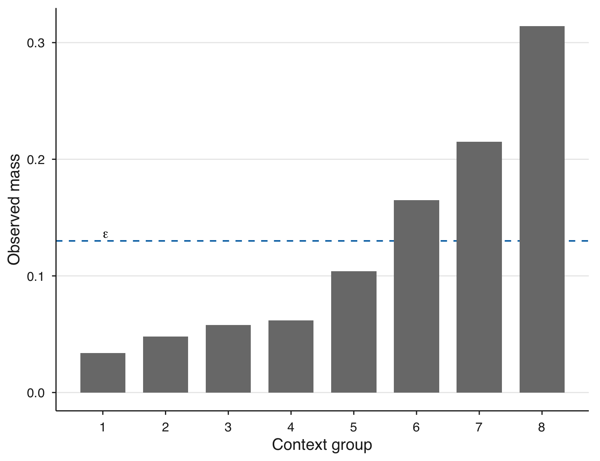{#fig-rotating-mass}

{#fig-rotating-coverage}

Rotating invalidity: a common RCPD reference can satisfy every pointwise
coverage constraint although no context is valid across the full grid.
:::

### Independent finite-sample certification

The empirical projection attains its constraints on the sample used to fit
$\lambda$; that equality is not a population guarantee. Condition on the
prediction model, validity rule, projection sample, and $M$ predeclared fitted
multiplier vectors $\lambda_c\geq0$. For an independent audit context $U$, set
$$r_c(U)=\exp\{\lambda_c^\top h(U)-\|\lambda_c\|_1\}\in(0,1].$$ {#eq-audit-tilt}
For target coverage $\tau=1-\epsilon$, candidate $c$ satisfies its population
coverage constraint at grid point $k$ exactly when
$$
\mu_{ck}=\mathbb E_P[r_c(U)\{h_k(U)-\tau\}]\geq0.
$$ {#eq-audit-moment}

```{=latex}
\begin{proposition}[Finite-sample audit certificate]
\label{prop-certified-rcpd}
```
Let $U_1,\ldots,U_m$ be i.i.d. audit contexts independent of all pre-audit
objects and put $X_{ick}=r_c(U_i)\{h_k(U_i)-\tau\}$. Let $\bar X_{ck}$ and
$S^2_{ck}$ be its sample mean and variance and
$B_{ck}=(1-\tau)+\tau\exp(-\lambda_{ck})$. For $m\geq2$, define
$$
L_{ck}=\bar X_{ck}
-\sqrt{\frac{2S^2_{ck}\log(2MK/\delta)}{m}}
-\frac{7B_{ck}\log(2MK/\delta)}{3(m-1)}.
$$ {#eq-audit-lcb}
Conditional on all pre-audit objects, with probability at least $1-\delta$,
every candidate satisfying $\min_kL_{ck}\geq0$ has population tilted coverage
at least $\tau$ at every grid point. Any audit-data-dependent selection among
certified candidates preserves the guarantee. If none is certified, the
procedure abstains.
```{=latex}
\end{proposition}
```

The result applies a standard empirical Bernstein bound
[@maurer2009empirical] and a union bound over candidates and grid points, in the
spirit of learn-then-test calibration [@angelopoulos2025ltt]. Its
RCPD-specific step is @eq-audit-moment, which turns a self-normalized coverage
constraint into the sign of a bounded ordinary mean. We select the certified
candidate with smallest projection-sample KL cost. The guarantee is for the
frozen rule, finite grid, and predeclared family; it does not certify the
scientific adequacy of the rule, continuum coverage, or uncertainty bands for
the resulting curve. Proofs of both propositions and continuum extensions are
in the online supplement.

### Estimation protocol and scope

The prediction model and validity rule are learned on separate training and
calibration data. RCPD weights are fitted on untouched reference contexts. For
certification, those contexts are divided into projection and audit splits; a
further evaluation split is used when uncertainty for the selected curve is
reported. Calibration uses the split-conformal order statistic
$\lceil(n_{\rm cal}+1)(1-\alpha)\rceil$, which gives marginal calibration for
the chosen score under exchangeability but does not make ISC conditionally
calibrated at fixed $z$. These are predictive model-query estimands, not causal
effects.

The primary inferential target is explicitly conditional. Let
$\mathcal D_{\rm pre}$ contain the data used to fit the prediction model,
validity learner, threshold, grid, and candidate tilts. Conditional on
$\mathcal D_{\rm pre}$, the target is
$z\mapsto\mathbb E_{Q_\epsilon^*(\mathcal D_{\rm pre})}
[f_{\mathcal D_{\rm pre}}(z,U)]$. The certificate controls population
validity of this frozen, randomly learned object. It does not target a
hypothetical deterministic population validity rule. Repeating training and
calibration changes the target itself; the supplement reports this
validity-target drift separately from evaluation variation.

The operational workflow is:

1. Predeclare $G$, the score, $\alpha$, candidate tolerances, and diagnostics.
2. Fit $f$ and the validity rule on designated training and calibration data.
3. On projection contexts, form the $m\times K$ validity matrix, check
   feasibility, and fit candidate exponential tilts.
4. On an independent audit split, certify or reject each frozen candidate;
   abstain if none passes.
5. Estimate the selected fixed-reference curve on evaluation contexts and
   report minimum validity, hard common mass, KL, maximum normalized weight,
   and effective sample size with the curve.

Forming the validity matrix costs $O(mK)$ score evaluations. Optimization is
over $K$ dual multipliers, or equivalently over at most $2^K$ observed
validity-pattern cells; in practice only the observed cells are retained.
RCPD is useful when the scientific contrast requires one population across the
displayed range. It is not a default replacement for PD or conditional
effects. Infeasibility and failed certification force abstention. For weight
concentration there is no distribution-free universal cutoff: analyses should
predeclare a minimum effective count adequate for their desired precision and
treat violations as an unstable estimand. We additionally report the ESS
fraction, KL, and maximum weight so that severe population restriction cannot
be hidden by a smooth curve. Complete continuum reductions, active-set
asymptotics, and uncertainty diagnostics are provided in the supplement.

## Empirical evaluation {#sec-experiments}

We use three complementary designs. First, synthetic experiments isolate
composition and compare methods against externally specified targets. The main
composition design draws 300 samples of size 1,000 from
$U\sim N(0,1)$ and $X=U+N(0,0.45^2)$, uses 21 grid points on
$[-0.75,0.75]$, and accepts $|z-U|\leq\Phi^{-1}(0.975)0.45$. Two prediction
surfaces agree on every accepted query but differ outside that set. A second
interaction design makes the original-population feature effect known and
compares the support-qualified alternatives. To include a near conditional
competitor without conflating estimands, a depth-two CART partitions the
context $U$ to make $X$ more homogeneous and reports one conditional-subgroup
PDP per terminal node, following the cs-PDP principle of @molnar2024. A broader
six-model matrix, calibration and grid sensitivity, competing constraint
semantics, and resampling diagnostics are reported in the supplement.

Second, the California Housing application [@pace1997] uses median house value
as response and Longitude as focal feature. The held-out, prespecified design
fixes 30 previously unused training/calibration/evaluation splits, the central
40th--60th percentile Longitude range, $K=21$, $\alpha=0.10$,
$\epsilon\in\{0.10,0.15,0.20\}$, two validity learners, and random-forest and
gradient-boosting predictors. The middle tolerance is the central predeclared
reporting value. Third, a controlled Bank Marketing stress test
[@uci_bank_marketing] modifies predictions only at rejected queries to isolate
the failure mode. Complete settings and all secondary applications are in the
supplement.

## Results

### Composition and the common-reference trade-off

In the additive composition design, pointwise trimming has mean normalized
shape error
`r fmt(composition_results$normalized_shape_error[composition_results$method == "Pointwise trim" & composition_results$extension == "Upward extension"], 3)`,
whereas hard CSPD recovers the known shape to numerical precision and RCPD
reduces the error to
`r fmt(composition_results$normalized_shape_error[composition_results$method == "RCPD" & composition_results$extension == "Upward extension"], 3)`.
The two prediction functions agree on every accepted query, yet their centered
ordinary-PD curves differ by
`r fmt(composition_results$extension_sensitivity[composition_results$method == "PDP" & composition_results$extension == "Upward extension"], 3)`;
hard CSPD and pointwise trimming are invariant, and RCPD reduces the difference
to
`r fmt(composition_results$extension_sensitivity[composition_results$method == "RCPD" & composition_results$extension == "Upward extension"], 3)`
(@fig-composition). ALE performs well in this additive design; RCPD is not
claimed to dominate methods with different estimands.

::: {#fig-composition layout-ncol=2 fig-pos="H"}
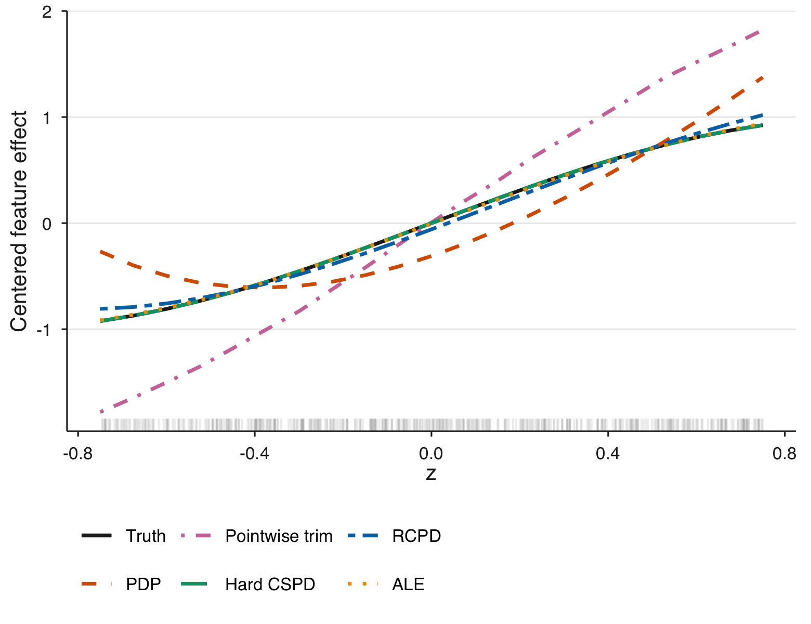{#fig-composition-curves}

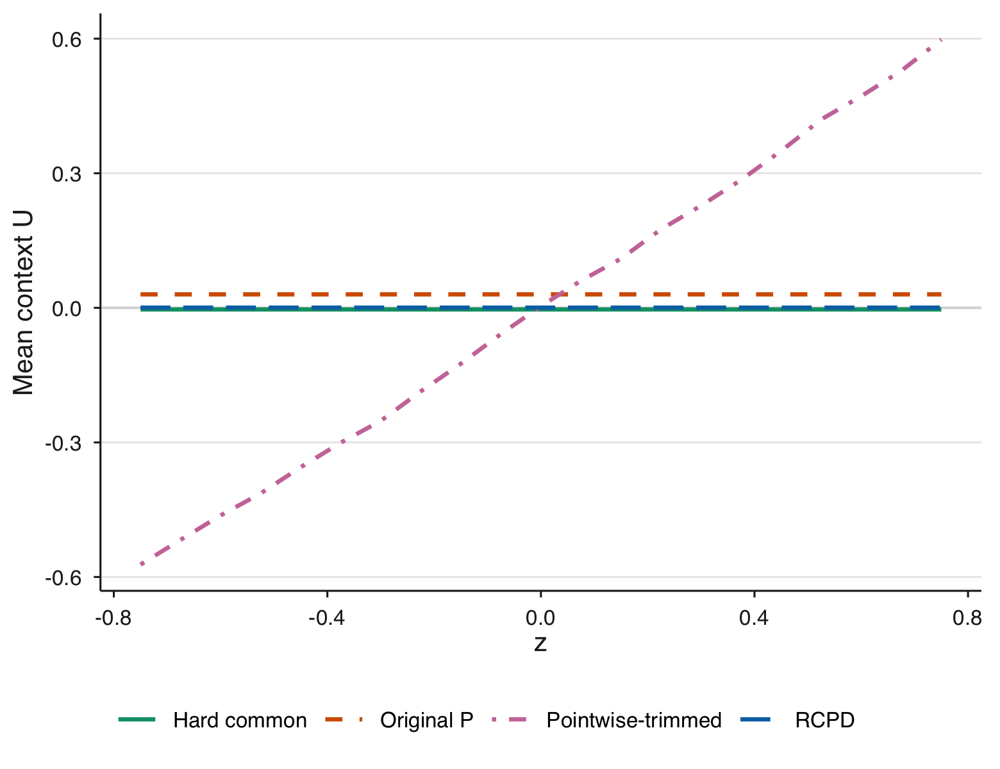{#fig-composition-context}

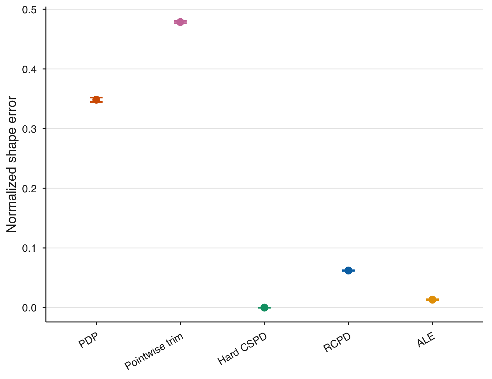{#fig-composition-error}

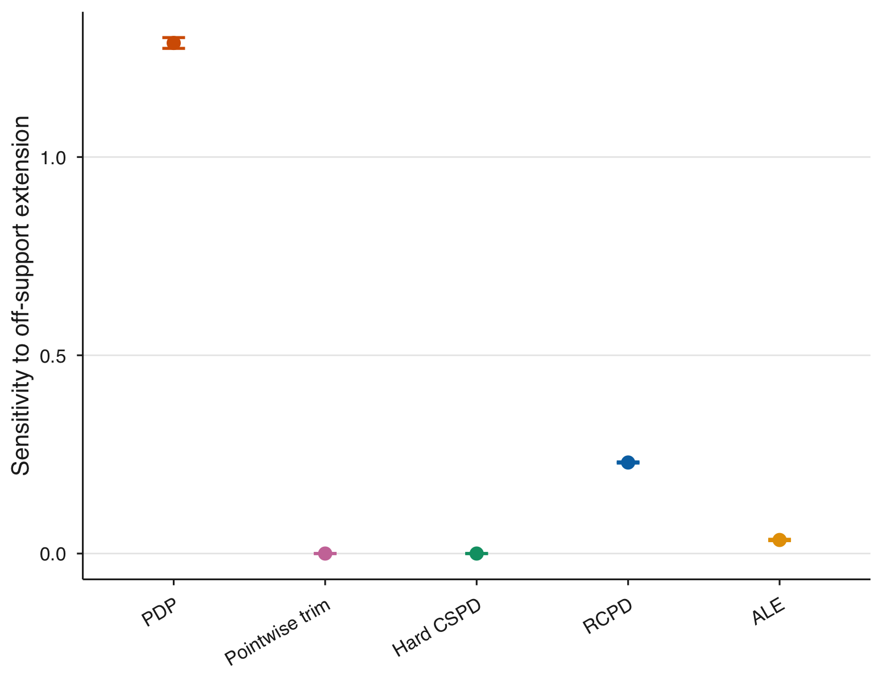{#fig-composition-sensitivity}

Composition trap with an externally known additive target. Bars are twice the
Monte-Carlo standard error over 300 repetitions.
:::

The conditional-subgroup comparison in @fig-conditional-subgroup clarifies why
cs-PDP and RCPD should not be ranked as interchangeable estimators. The CART
partition produces four context populations and therefore four curves. Within
each subgroup's central focal-feature range (thick segments), the curves expose
the common additive response shape with different subgroup compositions.
Outside those ranges the thin segments again require extrapolative queries; for
the two extreme groups, their central ranges do not intersect the declared
global intervention interval. RCPD answers a different question: it seeks one
global population that can be used at every displayed $z$.

::: {#fig-conditional-subgroup layout-ncol=2 fig-pos="H"}
{#fig-cs-partition}

{#fig-cs-curves}

Conditional-subgroup-style comparison in the additive composition design.
The comparator intentionally returns several local curves rather than one
global effect.
:::

The interaction design identifies the narrower regime in which a relaxed fixed
reference helps. Ordinary PD is the unrestricted oracle benchmark and has the
smallest error because its prediction surface is trusted everywhere. Among the
support-qualified alternatives, RCPD is closest to the known
original-population target; hard CSPD changes the context mixture sharply and
pointwise trimming changes it with $z$ (@tbl-external-comparison).

```{r}
#| label: tbl-external-comparison
#| tbl-cap: "Externally anchored interaction comparison over 300 repetitions. Error is centered sup-norm distance from the known original-population effect divided by its amplitude."
#| tbl-pos: H
#| results: asis
comparison_methods <- c("Ordinary PD", "RCPD", "Hard CSPD", "PTPD", "ALE")
comparison_table <- data.frame(
  Method = comparison_methods,
  `Normalized shape error` = sprintf(
    "%.3f (%.4f)",
    vapply(comparison_methods, s29_value, numeric(1),
           variable = "normalized_shape_error"),
    vapply(comparison_methods, s29_value, numeric(1),
           variable = "normalized_shape_error_mc_se")
  ),
  check.names = FALSE
)
knitr::kable(comparison_table, format = "latex", booktabs = TRUE,
             align = c("l", "r"),
             row.names = FALSE)
```

The broader simulation matrix reinforces the support diagnostic rather than a
method ranking. At correlation 0.8 and the widest grid, oracle mean ISC is
0.734 while hard common mass is only 0.076. Calibrated residual and conditional
density scores coincide in the homoskedastic Gaussian design; locally scaled
and kNN rules induce different accepted-query populations despite using the
same calibration rank. Full model-by-grid results are relegated to the
supplement.

### Finite-sample certification

The certificate audits eight predeclared projection tolerances with target
coverage 0.90 and family-wise error probability 0.10. The empirical-Bernstein
rule abstains at audit size 2,500 and certifies in
`r fmt(100 * s31_value("empirical_bernstein", 5000, "certification_rate"), 0)`\%
of 100 repetitions at size 5,000. No population violation is observed among
certified candidates on an independent deterministic 100,000-context
approximation. By contrast, the uncertified same-sample plug-in candidate
violates the population target in
`r fmt(100 * s31_value("empirical_bernstein", 5000, "naive_violation_rate"), 0)`\%
of paired repetitions. Mean selected fitting tolerance rises from
`r fmt(s31_value("empirical_bernstein", 5000, "mean_selected_epsilon"), 3)`
at 5,000 to
`r fmt(s31_value("empirical_bernstein", 20000, "mean_selected_epsilon"), 3)`
at 20,000 as the audit becomes less conservative. Hoeffding remains too
conservative to certify in this range. The complete operating-characteristic
table is in the supplement.

### California Housing

The two fitted models have comparable median held-out RMSE
(`r fmt(s33_value("Gradient boosting", "Conditional Gaussian density", 0.15, "median_rmse"), 3)`
for boosting and
`r fmt(s33_value("Random forest", "Conditional Gaussian density", 0.15, "median_rmse"), 3)`
for the forest), yet common-reference restriction changes their Longitude
contrasts differently. Raw endpoint contrasts below are followed in parentheses
by the contrast divided by the held-out prediction IQR.

At $\epsilon=0.15$, the forest's median ordinary-PD contrast is
`r s33_endpoint("Random forest", "Conditional Gaussian density", "pd")`.
RCPD changes it to
`r s33_endpoint("Random forest", "Conditional Gaussian density", "rcpd")`
under density validity and
`r s33_endpoint("Random forest", "Locally scaled residual", "rcpd")`
under locally scaled residual validity. The signs differ from ordinary PD in
all 30 splits for both rules. For boosting, ordinary PD is more strongly
negative (`r s33_endpoint("Gradient boosting", "Conditional Gaussian density", "pd")`),
while RCPD attenuates it to
`r s33_endpoint("Gradient boosting", "Conditional Gaussian density", "rcpd")`
and
`r s33_endpoint("Gradient boosting", "Locally scaled residual", "rcpd")`.
ALE is an observational comparator, not an estimator of the same fixed-reference
functional.

::: {#fig-california-heldout layout-ncol=2}
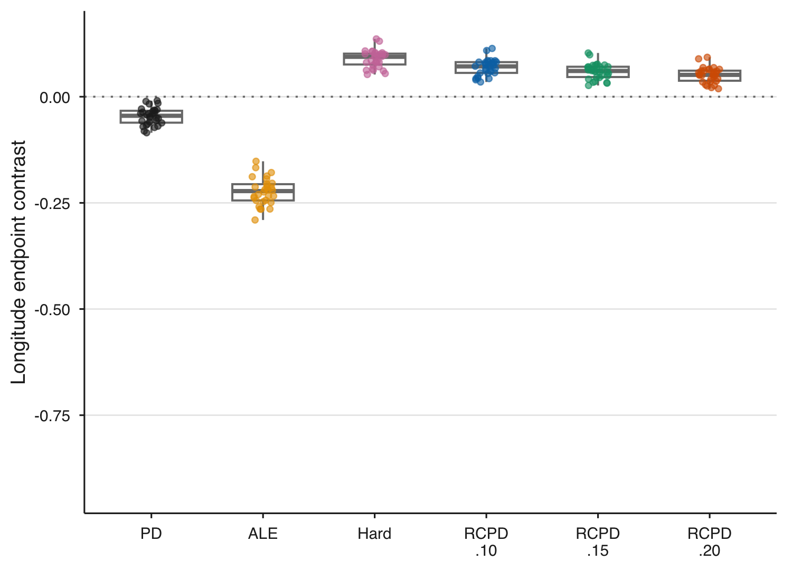{#fig-california-forest-density}

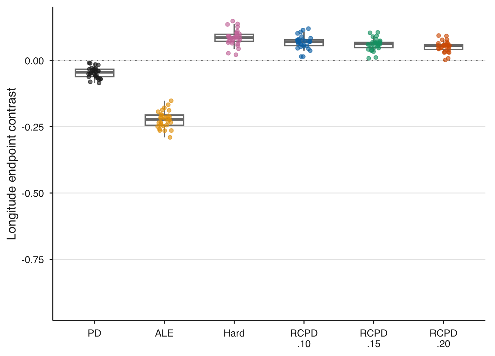{#fig-california-forest-scaled}

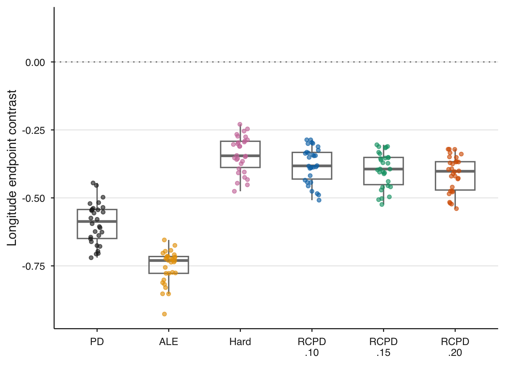{#fig-california-boosting-density}

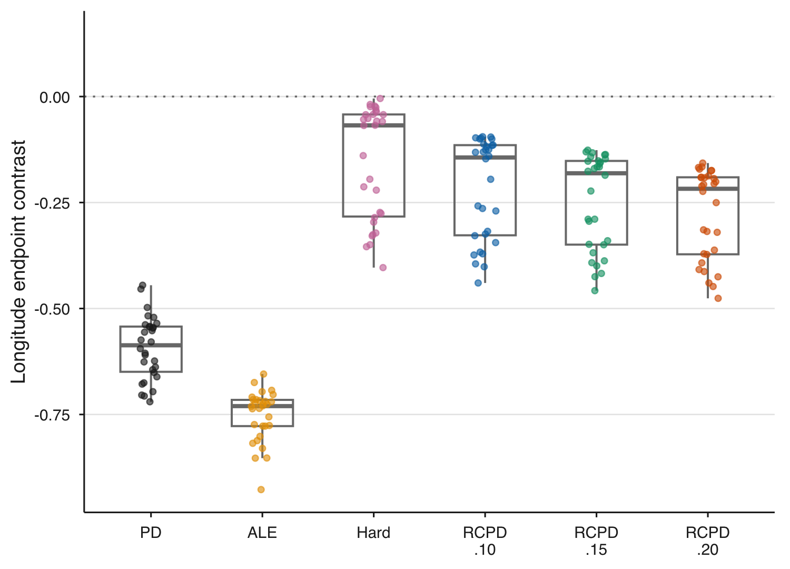{#fig-california-boosting-scaled}

Held-out repeated-split California Housing application. Endpoint contrasts compare the
ends of the central 20% Longitude interval. Points are 30 fresh splits; boxes
summarize their distributions.
:::

The population change is substantial and must temper the interpretation. At
$\epsilon=0.15$, the smallest median original-reference ISC is
`r fmt(min(s33_audit_value("Conditional Gaussian density", "min_isc_median"), s33_audit_value("Locally scaled residual", "min_isc_median")), 3)`.
Median effective fractions are
`r fmt(s33_audit_value("Conditional Gaussian density", "rcpd_ess_fraction_median"), 3)`
and
`r fmt(s33_audit_value("Locally scaled residual", "rcpd_ess_fraction_median"), 3)`,
with KL costs
`r fmt(s33_audit_value("Conditional Gaussian density", "rcpd_kl_median"), 2)`
and
`r fmt(s33_audit_value("Locally scaled residual", "rcpd_kl_median"), 2)`.
Thus RCPD reveals a different, small effective subpopulation rather than a
correction toward a privileged truth. Complete balance, active-set, and
sensitivity diagnostics are in the supplement.

The reference-population diagnostics in @fig-california-reference make that
change concrete. Both validity rules upweight blocks with systematically
different Latitude, income, housing, and occupancy profiles; the interquartile
ranges across the 30 splits show that the shifts are reproducible rather than
an isolated split artifact. The covariance identity in @eq-rcpd-covariance
then links those fixed weight shifts to the fitted curve: RCPD differs from PD
only where the projected weights align with prediction heterogeneity. The
weights are chosen without inspecting either prediction model, yet their same
geographic/contextual shift interacts differently with forest and boosting
predictions.

$$
\operatorname{RCPD}_{j,\epsilon}(z;G)-\operatorname{PD}_j(z)
=\operatorname{Cov}_P\!\left\{
\frac{dQ_\epsilon^*}{dP}(U),f(z,U)\right\}.
$$ {#eq-rcpd-covariance}

::: {#fig-california-reference layout-ncol=2}
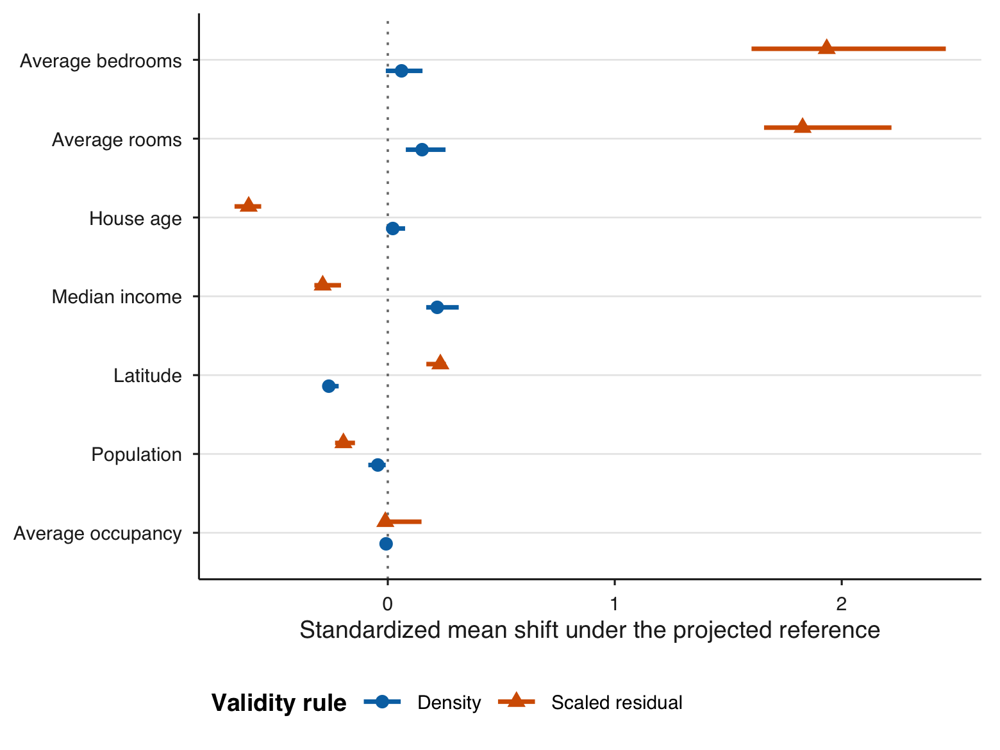{#fig-california-balance}

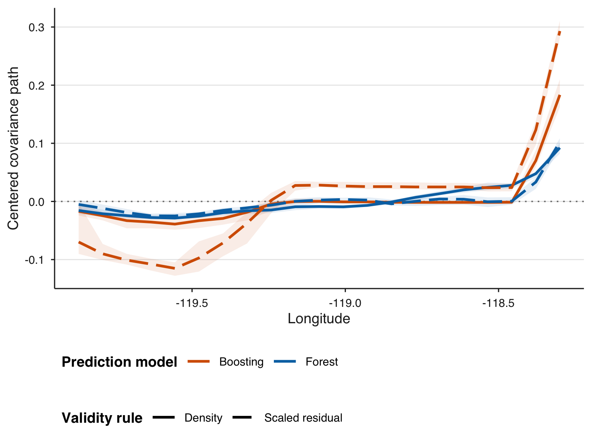{#fig-california-covariance}

Who the California RCPD reference population represents at $\epsilon=0.15$.
:::

```{=latex}
\FloatBarrier
```

### Off-support stress test

Following the manipulation logic of @xin2025, the Bank Marketing experiment
adds a fixed logit shift only to rejected age queries. The original and modified
predictors agree on every accepted query and on
`r fmt(100 * bank_stress$observed_unchanged_fraction, 1)`\% of held-out observed
records; held-out Brier score changes from
`r fmt(bank_stress$original_brier, 3)` to
`r fmt(bank_stress$stressed_brier, 3)`, a relatively modest change compared
with the PD perturbation. Nevertheless, the centered ordinary-PD
curve changes by `r fmt(s32_distance("Ordinary PD"), 3)` in sup norm. RCPD
attenuates the change to `r fmt(s32_distance("RCPD"), 3)`, while hard CSPD and
pointwise trimming are invariant because the perturbation is zero on all their
queried pairs (@fig-bank-stress).

::: {#fig-bank-stress layout="[[2,1]]" fig-pos="H"}
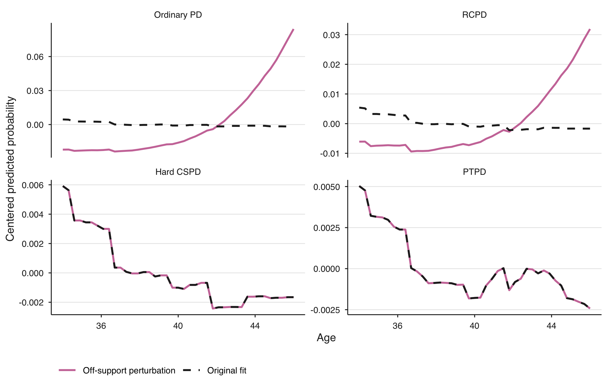{#fig-bank-stress-curves}

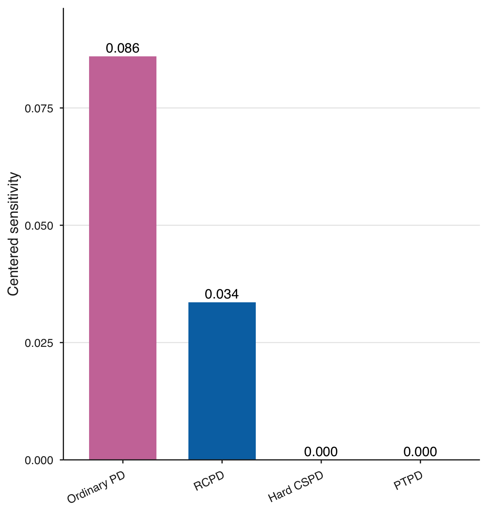{#fig-bank-stress-distance}

Controlled off-support perturbation on held-out Bank Marketing contexts. This
isolates a failure mode; it is not evidence that the fitted model naturally
contains the adversarial extension.
:::

## Discussion {#sec-discussion}

The paper makes a focused estimand-design contribution. ISC quantifies the
declared compatibility of ordinary-PD queries, while the admissible-extension
envelope retains ordinary PD as the target when rejected predictions are not
trusted. If a fixed
support-qualified population is scientifically required, hard CSPD and RCPD
separate model-response shape from changing context composition. RCPD uses
classical information projection; its value is the formulation of simultaneous
PD-query constraints and the auditable validity--fidelity frontier.

The independent certificate strengthens that formulation without turning it
into general inference for explanations. For a frozen validity rule, finite
grid, and finite candidate family, it prevents a same-sample active constraint
from being misread as population validity. It either certifies every declared
grid point or abstains. Learned-rule error, continuum coverage, and uncertainty
for the selected curve remain separate problems.

The empirical evidence delineates rather than erases the trade-off. Fixed
references remove composition-driven shape in the synthetic example. In
California, support qualification reverses the forest contrast and attenuates
the boosting contrast, but only after substantial reweighting; the estimand is
a small effective subpopulation. The Bank experiment shows why an audit can
matter when predictive performance changes relatively modestly compared with a
large PD perturbation. Secondary
applications in the supplement show the complementary case in which severe
support diagnostics leave centered curves nearly unchanged because projection
weights align weakly with prediction heterogeneity.

No method here is a corrected PD. The score, threshold, intervention range,
tolerance, and reference convention determine the question being answered.
Future work should address certified continuum constraints and inference for
learned validity rules. A support-constrained explanation breakdown point --
the least additional information distortion required to reverse a qualitative
curve conclusion -- is a promising robustness extension, but is kept outside
the present claims pending a dedicated novelty and inferential analysis.

## Code and data availability

The submission archive contains the R implementation, tests, fixed seeds,
result objects, source archive, `renv.lock`, and a `targets` pipeline that
regenerates every reported table and figure. Data acquisition and redistribution
conditions are documented in the archive.

```{=latex}
\acks{No funding was received for this work. The author declares no competing
interests.}
```
