```{r}
#| include: false
s22 <- targets::tar_read(s22_summary, store = "../_targets")
s40 <- targets::tar_read(s40_summary, store = "../_targets")
s40_california <- targets::tar_read(s40_california_summary, store = "../_targets")
s26 <- targets::tar_read(s26_summary, store = "../_targets")
s31 <- targets::tar_read(s31_summary, store = "../_targets")
lipschitz_wine <- targets::tar_read(s30_summary, store = "../_targets")
california_results <- targets::tar_read(s33_summary, store = "../_targets")
california_audit <- targets::tar_read(s33_audit, store = "../_targets")
wine_results <- targets::tar_read(case_study_s16, store = "../_targets")
large_results <- targets::tar_read(case_studies_s17, store = "../_targets")
relaxation_results <- targets::tar_read(s18_summary, store = "../_targets")
wine_additive <- wine_results[
  wine_results$model_name == "additive_gam", , drop = FALSE
]
wine_nonadditive <- wine_results[
  wine_results$model_name == "boosted_tree", , drop = FALSE
]
bank_results <- large_results[[1]]
shopper_results <- large_results[[2]]
bank_scores <- attr(bank_results, "score_comparison")
fmt <- function(x, digits = 3L) formatC(x, format = "f", digits = digits)
s30_width <- function(scenario, variable) {
  lipschitz_wine$widths[
    lipschitz_wine$widths$scenario == scenario, variable, drop = TRUE
  ]
}
```

## Experimental settings and reproducibility map

All experiments use independent training, calibration, and evaluation splits;
fixed seeds and complete parameter grids are stored in the targets pipeline.
The broad matrix has sample sizes 200/200/400, a 21-point grid, correlations
0.2, 0.5, and 0.8, grid half-widths 0.4, 0.75, and 1.1, five validity rules
(oracle, split conformal, conditional density, locally scaled, and kNN), six
prediction-model classes, and 100 repetitions. The focused relaxation
study uses 1,000 evaluation rows, $\rho=0.8$, $\alpha=0.05$, and
$\epsilon\in\{0,0.05,0.10,0.20,0.30\}$ over 100 repetitions.

The externally anchored interaction design uses 300 repetitions, 400
evaluation contexts, $U\sim N(0.2,0.7^2)$,
$X_1=U+N(0,0.35^2)$, a 21-point grid on $[-0.5,0.5]$, and
$f(z,u)=\sin(\pi z)+1.4u+2.5zu$. The rotating-invalidity design uses eight
context groups and 300 samples of size 1,000; a group-$g$ context is invalid
only at grid point $g$, so pointwise constraints are feasible although
simultaneous-valid mass is zero. The error decomposition uses 200 repetitions
at balanced training/calibration sizes 75--1,200. The calibration and
continuum experiments respectively use 200 and 100 repetitions; the latter
compares display grids of 3--81 points with exact separation over all empirical
interval cells.

The finite-sample certificate uses 100 repetitions, a projection sample of
1,000, independent audit samples of 2,500--20,000, eight predeclared candidate
tolerances, target tolerance 0.10, family-wise error probability 0.10, and a
21-point grid. The nonlinear-manifold learner comparison uses 40 repetitions
with 150/150/300 observations and contrasts a linear residual rule with a
calibrated 15-nearest-neighbour score. Numerical outputs and panels omitted
from this compact supplement remain indexed in the reproducibility archive.

## Additional synthetic comparisons

The main article reports only the externally anchored summary. The full
interaction comparison shows why RCPD is useful only in a specific regime:
ordinary PD is the oracle benchmark when the fitted surface is trusted
everywhere, whereas RCPD is closest among the support-qualified alternatives
when hard conditioning distorts the context mixture and a fixed reference is
required.

{#fig-s-rcpd-comparison-error width="67%"}

The rotating-invalidity construction distinguishes the three possible
constraint semantics. Pointwise constraints control the worst displayed query,
an average constraint can hide a local deficit, and an intersection constraint
is infeasible when every context is invalid somewhere.

::: {#fig-s-constraint-comparison layout-ncol=2}
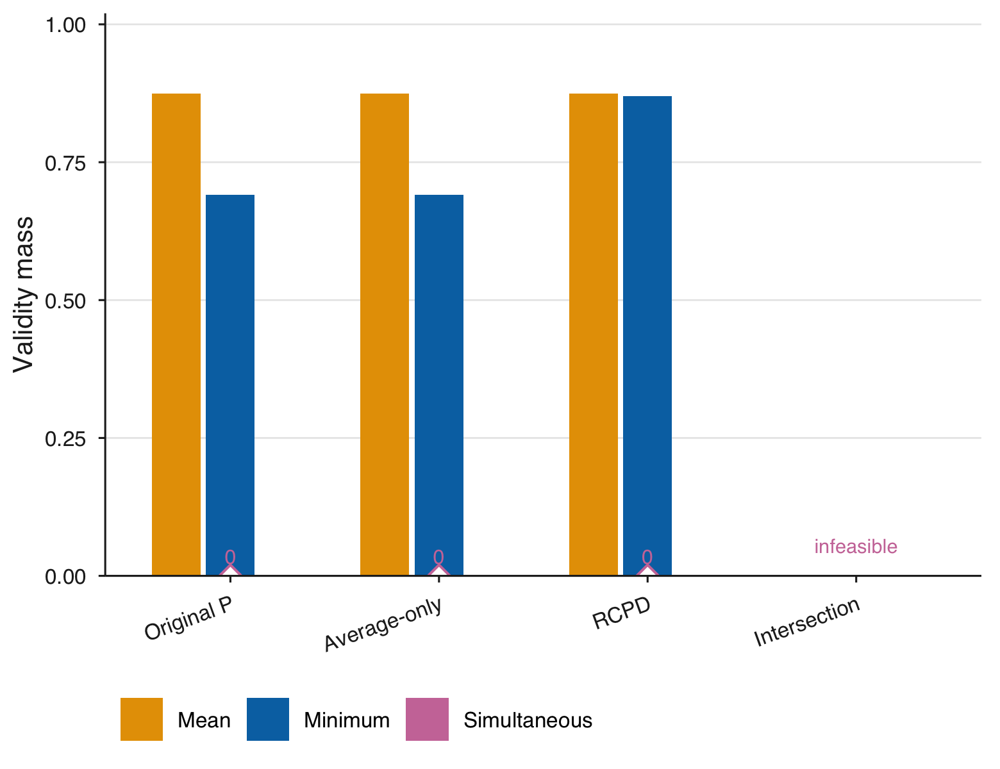{#fig-s-constraint-validity}

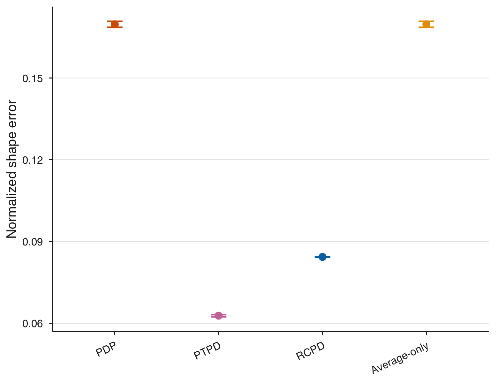{#fig-s-constraint-error}

Constraint comparison when every context is invalid at one grid point.
Pointwise validity does not imply positive simultaneous-valid mass.
:::

The full six-model matrix crosses model class, correlation, intervention range,
and validity learner. It is a stress test of the diagnostic geometry rather
than a ranking of feature-effect methods.

The spread across validity rules in @fig-s-matrix-gamma carries a warning for
any analysis that treats $\gamma_j(G)$ as a decision quantity. At correlation
0.8 and the widest displayed width the kNN rule reports an intersection mass of
0.67 where the oracle rule gives 0.08, an overstatement of almost an order of
magnitude: a flexible learned rule accepts queries the data do not support, and
the contract then looks satisfiable when it is clearly violated. The direction
is not universal. @sec-supplement-nonlinear reports the complementary case, in
which the same flexibility lets kNN track a curved validity boundary that the
linear rules miss. Flexibility therefore cuts both ways depending on the
geometry, which is why the main article uses the oracle rule when it reports
the intersection mass as a property of the dependence structure, and why an
applied analysis should report $\gamma_j(G)$ under more than one rule.

::: {#fig-s-experiment-matrix layout-ncol=2}
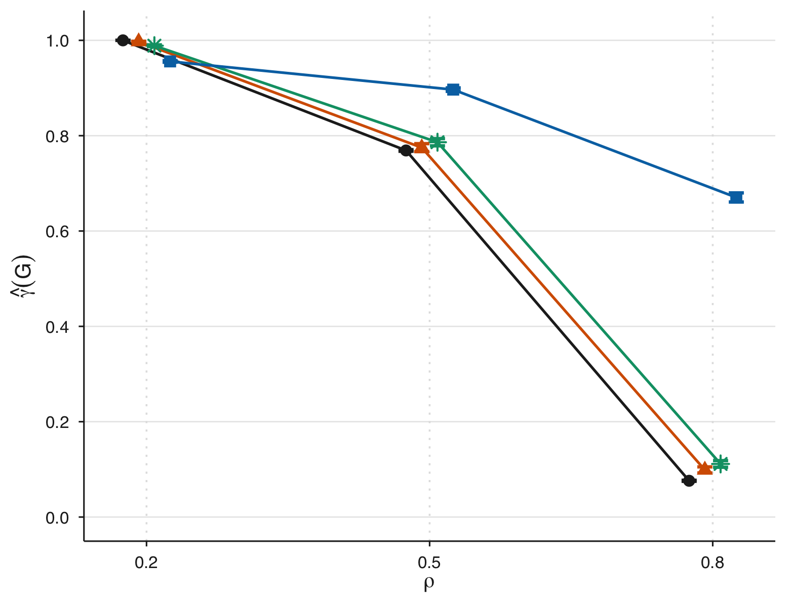{#fig-s-matrix-gamma}

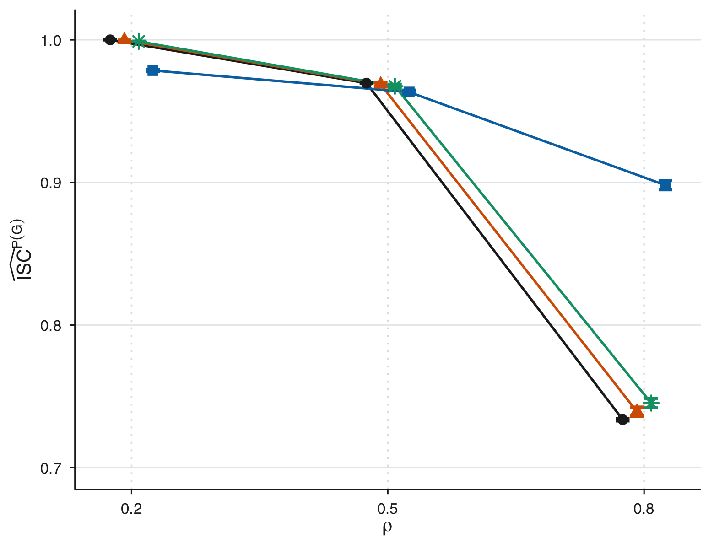{#fig-s-matrix-isc}

Broad simulation matrix at the widest displayed half-width. The series are
validity rules, not grid widths; the latter are tabulated by correlation in the
main article. Reading downwards at correlation 0.8 the order is kNN, locally
scaled, split conformal, and oracle, so the oracle rule is the most
conservative and matches the bottom row of Table 1 in the main article. The
conditional-density rule is omitted from the panels because it is numerically
identical to split conformal in this homoskedastic Gaussian design. Panel (b)
reports the mean rather than the minimum of the pointwise coverage, so the two
panels are ordered by
$\widehat\gamma(G)\leq\min_z\widehat{\mathrm{ISC}}^P(z)\leq
\overline{\widehat{\mathrm{ISC}}^P}$. Points summarize 100 repetitions for
each declared combination, pooled across the six prediction-model classes;
error bars are twice the Monte-Carlo standard error.
:::

The relaxation path makes the validity--fidelity trade-off explicit and keeps
the pointwise constraints separate from simultaneous-valid mass.

::: {#fig-s-relaxed-reference layout="[[1,1],[1]]"}
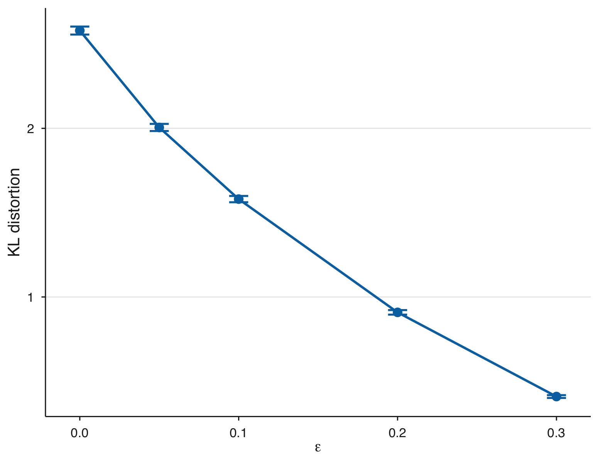{#fig-s-relaxed-kl}

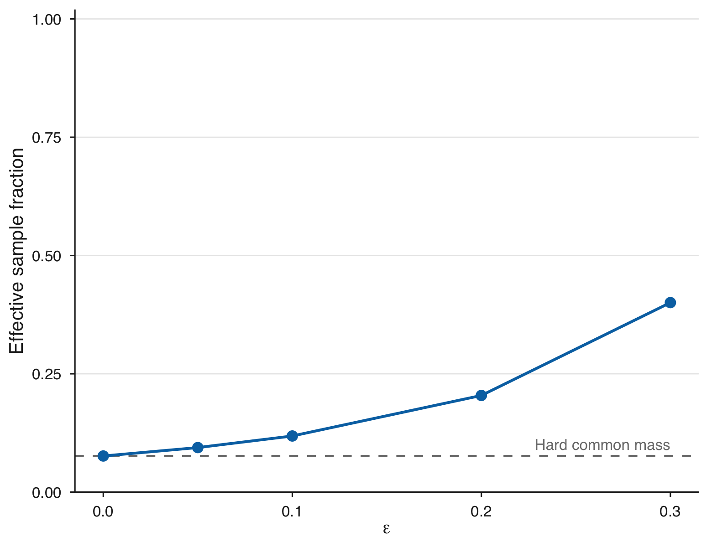{#fig-s-relaxed-ess}

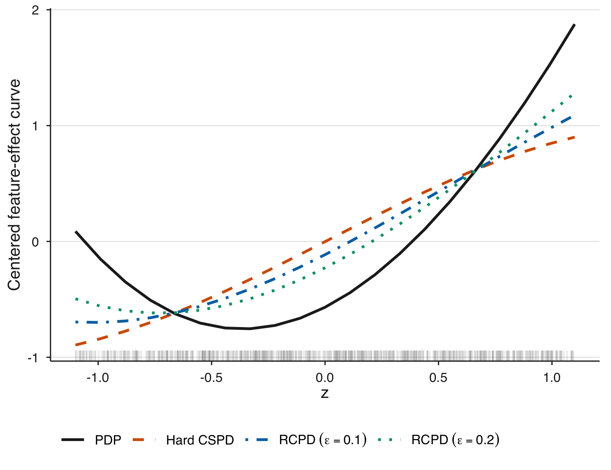{#fig-s-relaxed-curves}

Relaxed common-reference path over 100 repetitions. The dashed horizontal
benchmark in the ESS panel is hard common mass.
:::

Finally, the finite-sample error decomposition separates evaluation variation
from error in the learned validity target. The latter dominates fixed-oracle
undercoverage in the studied sample sizes.

::: {#fig-s-error-decomposition layout-ncol=2}
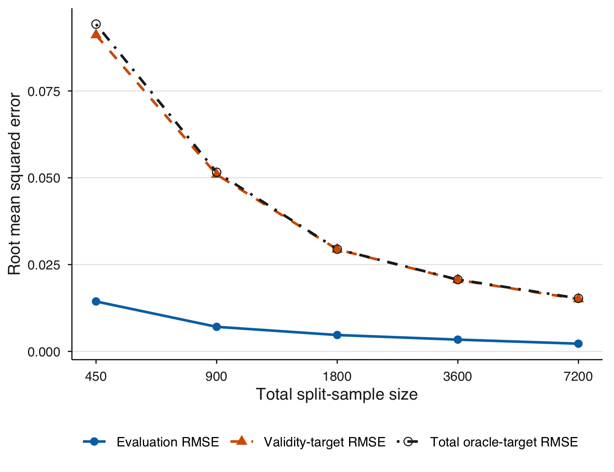{#fig-s-error-rmse}

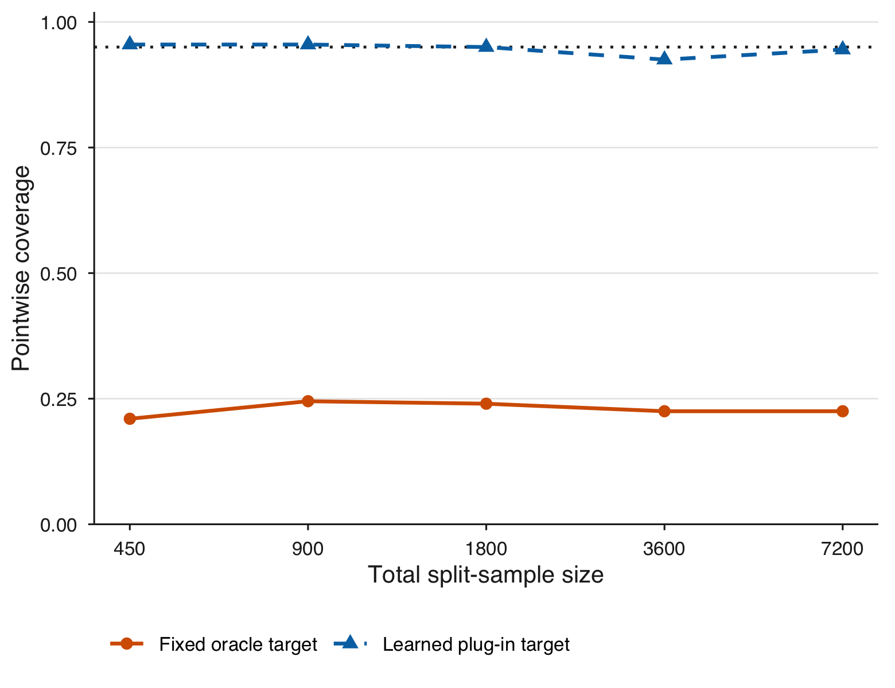{#fig-s-error-coverage}

Finite-sample decomposition over 200 repetitions. Evaluation-only uncertainty
does not account for validity-target drift.
:::

## Calibration convergence

The split-calibrated residual rule approaches the known Gaussian rule as the
training and calibration samples grow. The learned radius is on average 4.5%
larger than the oracle radius at split size 100, 2.1% larger at 200, and 0.2%
larger at 1,000. Because common mass intersects validity over the intervention
range, these small radius differences can have a larger relative effect on the
retained common population (@fig-s-calibration-mass; @fig-s-calibration-radius).

::: {#fig-s-calibration layout-ncol=2}
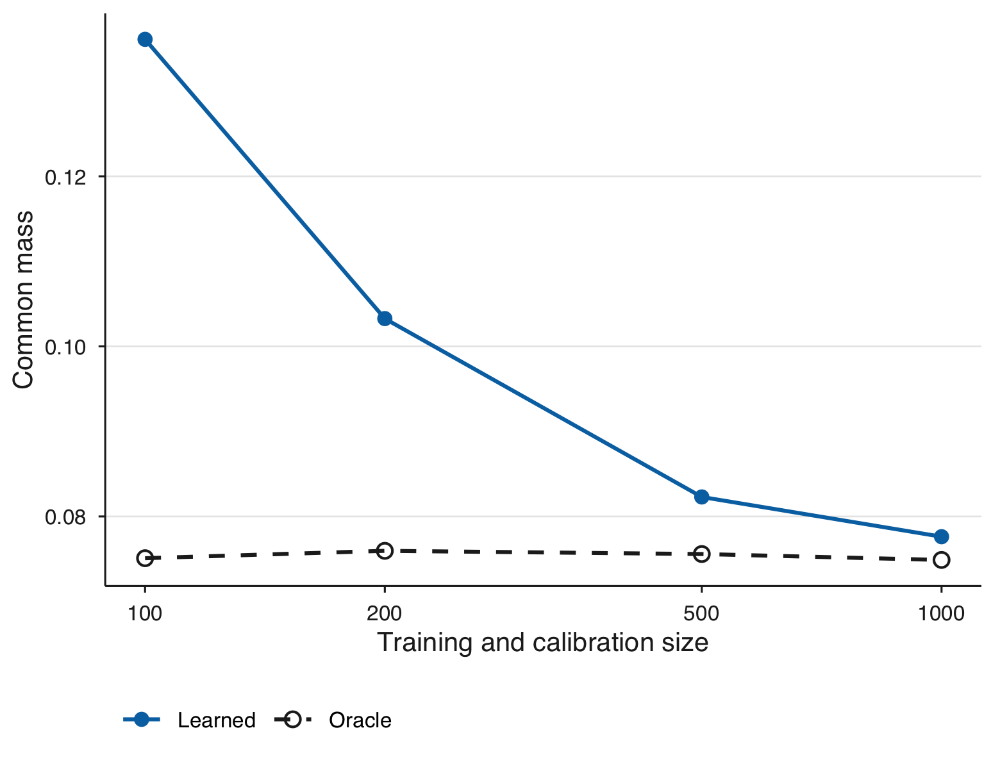{#fig-s-calibration-mass}

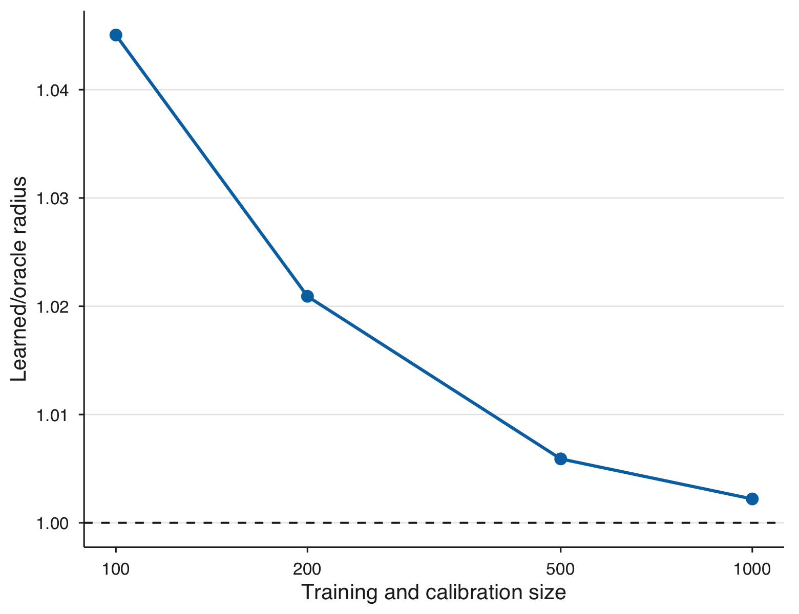{#fig-s-calibration-radius}

Finite-sample convergence of the split-calibrated residual rule to the known
Gaussian rule. Each point averages 200 repetitions; training and calibration
splits have the displayed common size and evaluation size is 2,000.
:::

## Exact continuum constraints and finite display grids

For empirical interval validity, the main article's critical-cell proposition
reduces the semi-infinite problem exactly. The experiment below contrasts that
solution with projections constrained only on display grids. The exact exchange
solver achieves minimum continuum coverage
`r fmt(s26$min_continuum_coverage[s26$method == "Exact exchange"], 3)` using
on average
`r fmt(s26$constraints_used[s26$method == "Exact exchange"], 1)` constraints.
The continuum check and computational burden are shown separately in
@fig-s-grid-coverage and @fig-s-grid-constraints.

::: {#fig-s-grid-resolution layout-ncol=2}
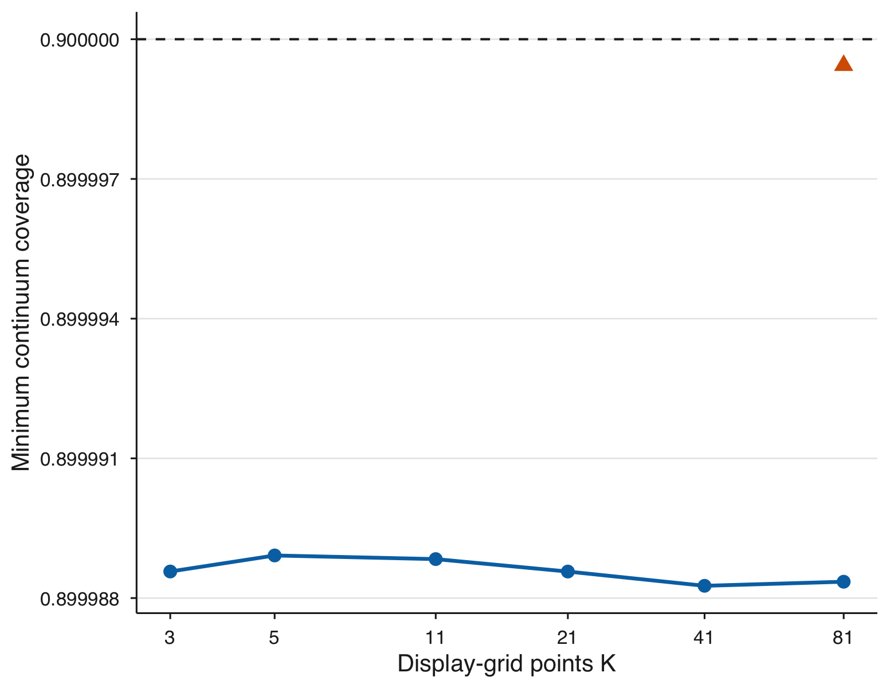{#fig-s-grid-coverage}

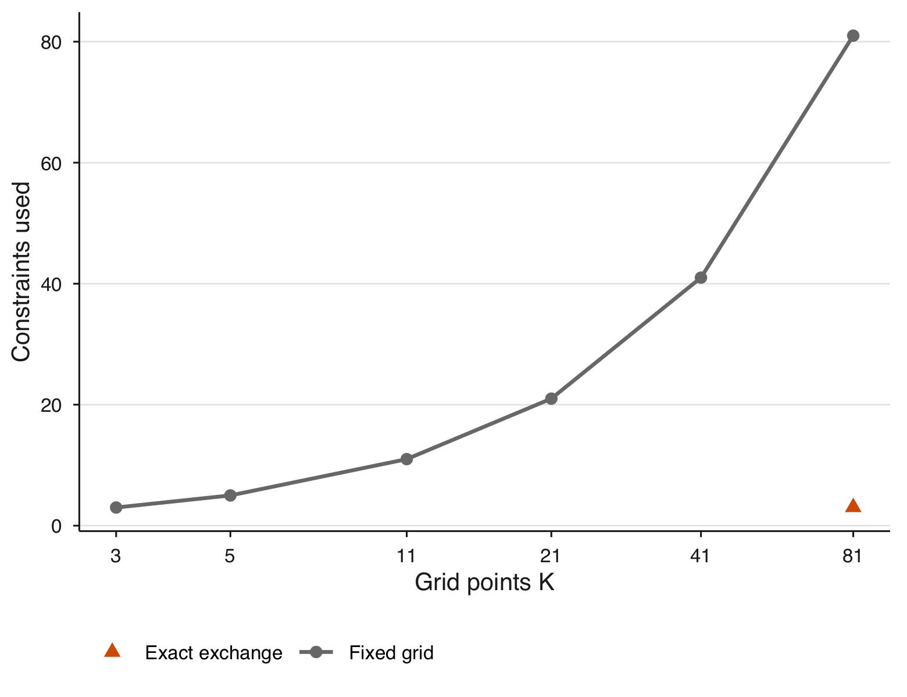{#fig-s-grid-constraints}

Fixed display grids compared with the exact empirical continuum projection.
Hard common mass is endpoint-determined. Fixed-grid solutions are evaluated on
all critical interval cells; triangles mark the exact exchange solution.
:::

## Finite-sample certification of projected weights

The optimization sample necessarily attains its active coverage constraints;
that same-sample equality is only a solver diagnostic. The finite-sample audit
proposition in the main article uses an independent sample to certify all grid constraints
simultaneously over the eight predeclared candidates. The table reports how
often at least one candidate is certified, the population violation rate among
certified selections, and the resulting validity--fidelity diagnostics.

```{r}
#| label: tbl-s-projection-audit
#| tbl-cap: "Finite-sample audit of learned RCPD tilts over 100 repetitions. The declared population coverage target is 0.90 and the family-wise error probability is 0.10. Population coverage is evaluated only for simulation assessment."
#| tbl-pos: H
#| results: asis
bound_labels <- c(
  empirical_bernstein = "Empirical Bernstein",
  hoeffding = "Hoeffding"
)
rate_or_dash <- function(x) ifelse(
  is.na(x), "--", sprintf("%.3f", x)
)
audit_table <- data.frame(
  Bound = unname(bound_labels[s31$bound]),
  `Audit n` = s31$audit_size,
  `Certification rate` = sprintf("%.2f", s31$certification_rate),
  `Violation given certified` = rate_or_dash(
    s31$violation_rate_among_certified
  ),
  `Mean fitted tolerance` = rate_or_dash(s31$mean_selected_epsilon),
  check.names = FALSE
)
knitr::kable(audit_table, format = "latex", booktabs = TRUE,
             align = c("l", "r", "r", "r", "r"),
             row.names = FALSE)
```

The empirical-Bernstein rule begins certifying between audit sizes 2,500 and
5,000 and has no observed population violations among its certified
selections. As the audit size grows, it admits candidates fitted closer to the
target tolerance; the mean effective-sample fraction consequently rises from
`r fmt(s31$mean_selected_ess_fraction[s31$bound == "empirical_bernstein" & s31$audit_size == 5000], 3)`
at 5,000 to
`r fmt(s31$mean_selected_ess_fraction[s31$bound == "empirical_bernstein" & s31$audit_size == 20000], 3)`
at 20,000, while mean population minimum coverage changes from
`r fmt(s31$mean_selected_truth_coverage[s31$bound == "empirical_bernstein" & s31$audit_size == 5000], 3)`
to
`r fmt(s31$mean_selected_truth_coverage[s31$bound == "empirical_bernstein" & s31$audit_size == 20000], 3)`.
The Hoeffding
rule is valid but substantially more conservative in this design. By contrast,
the same-sample plug-in candidate violates the population target in
`r fmt(s31$naive_violation_rate[[1]], 2)` of paired repetitions. These
simulation frequencies illustrate power and
conservatism; the guarantee itself is the conditional finite-sample statement
in the main article and allows up to the declared family-wise error probability.

## Projection-rate diagnostic

The regular-case projection diagnostic yields a fitted log--log slope of
`r fmt(unique(s22$log_log_slope), 3)`, close to the root-sample-size benchmark
$-1/2$. Strict complementarity holds in between
`r fmt(min(s22$strict_complementarity_rate), 2)` and
`r fmt(max(s22$strict_complementarity_rate), 2)` of replications across the
reported sample sizes.

{#fig-s-rcpd-rate width="78%"}

## Validity learning under nonlinear support {#sec-supplement-nonlinear}

The nonlinear-manifold experiment isolates validity-model misspecification. A
local kNN score improves the support diagnostics relative to the linear rule,
but its operational threshold still requires independent calibration
(@fig-s-learners-isc--@fig-s-learners-gamma).

::: {#fig-s-learners layout-ncol=3}
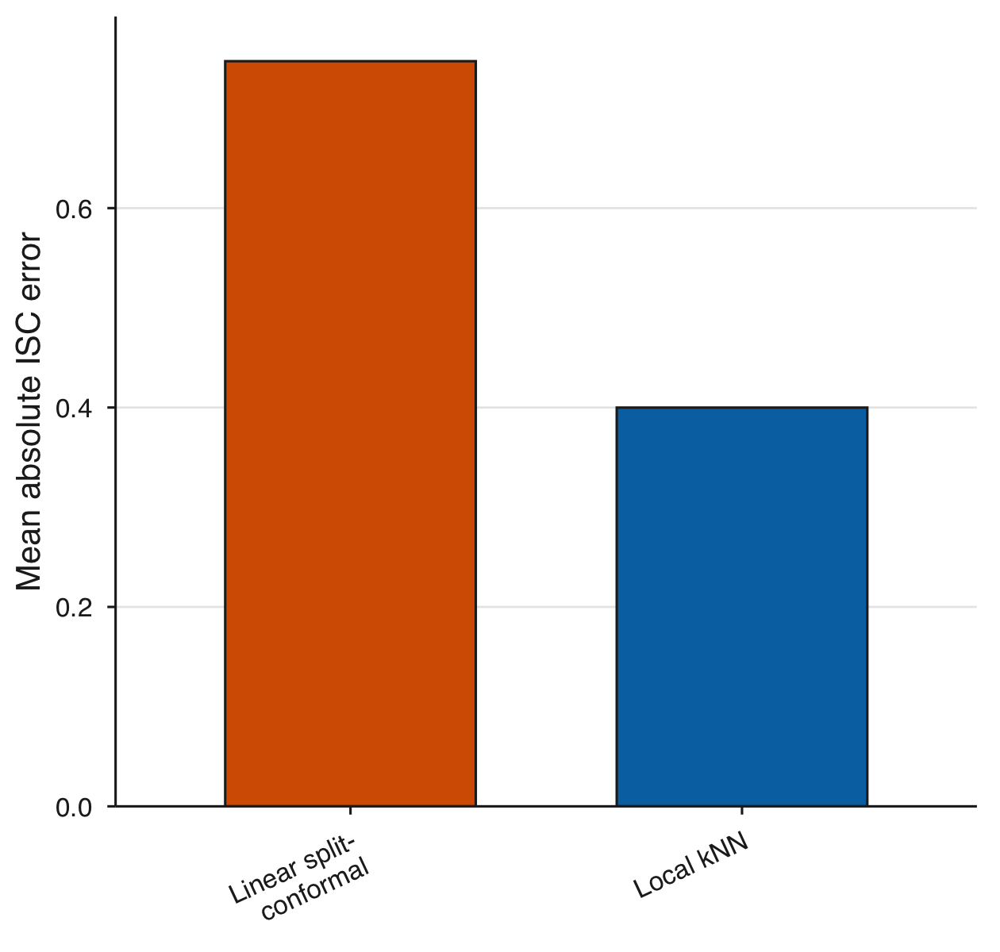{#fig-s-learners-isc}

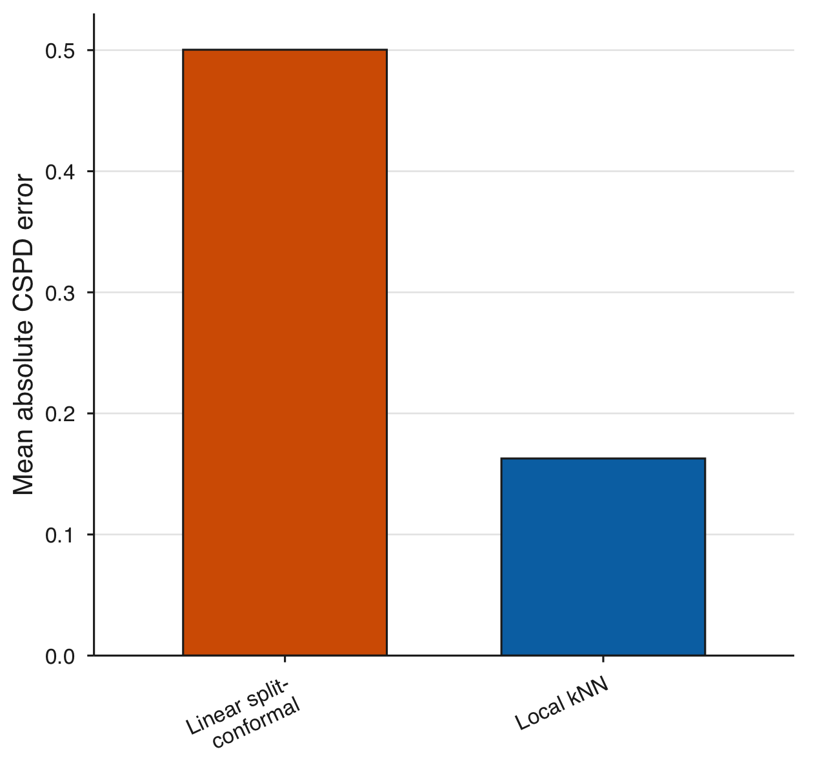{#fig-s-learners-cspd}

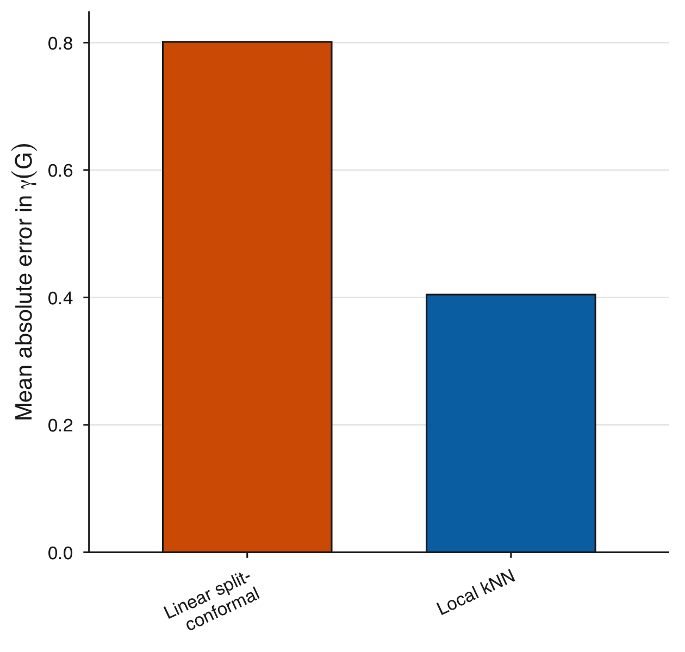{#fig-s-learners-gamma}

Validity-learner robustness on nonlinear support geometry.
:::

## California Housing held-out design and full audit

The held-out, prespecified application uses the 20,640 California Housing blocks and 30
fixed, previously unused seeds 20261101--20261130. Each seed defines a
60%/20%/20% training/calibration/evaluation split, giving 12,384 training,
4,128 calibration, and 4,128 evaluation observations. Longitude is displayed
on 21 equally spaced points between its training-set 40th and 60th percentiles.
The validity calibration level is $\alpha=0.10$ and the complete, fixed
relaxation matrix is $\epsilon\in\{0.10,0.15,0.20\}$. The middle value is used
for compact reporting in the main article but was not designated retrospectively
as a primary endpoint.

The random forest has 100 trees, $mtry=\lfloor\sqrt p\rfloor$, and terminal-node
size five. Gradient boosting has 1,000 depth-three trees, shrinkage 0.05,
minimum node size ten, and bag fraction 0.8. Its capacity was selected on the
excluded seed 20269991 before the held-out seeds were inspected. The two
validity rules are a locally scaled split-conformal residual band and a
conditional Gaussian-density score; both standardize predictors using only the
training split and calibrate their thresholds on the calibration split. ALE
uses 20 evaluation-sample quantile intervals and is interpolated to the same
display grid. It is an observational local-effect comparator, not the same
fixed-reference estimand as PD, hard CSPD, or RCPD.

```{r}
#| label: tbl-s-california-validity
#| tbl-cap: "California validity and projection audit at $\\epsilon=0.15$. Entries are medians over 30 splits; complete interquartile ranges and the full tolerance matrix are retained in the archived result object."
#| results: asis
learner_label <- c(
  "Conditional Gaussian density" = "Density",
  "Locally scaled residual" = "Scaled residual"
)
static_audit <- california_audit[
  california_audit$epsilon == 0.15, , drop = FALSE
]
compact_validity <- data.frame(
  Learner = unname(learner_label[static_audit$learner]),
  `Min. ISC` = sprintf("%.3f", static_audit$min_isc_median),
  `Mean ISC` = sprintf("%.3f", static_audit$mean_isc_median),
  gamma = sprintf("%.3f", static_audit$gamma_median),
  `Tol. min.` = sprintf("%.3f", static_audit$epsilon_min_median),
  `Min. validity` = sprintf("%.3f", static_audit$rcpd_min_coverage_median),
  `Mean validity` = sprintf("%.3f", static_audit$rcpd_mean_coverage_median),
  KL = sprintf("%.3f", static_audit$rcpd_kl_median),
  `ESS fraction` = sprintf("%.3f", static_audit$rcpd_ess_fraction_median),
  check.names = FALSE
)
cat("\\begingroup\n\\scriptsize\n\\setlength{\\tabcolsep}{2.5pt}\n")
cat(knitr::kable(compact_validity, format = "latex", booktabs = TRUE,
                 align = c("l", "r", "r", "r", "r", "r", "r", "r", "r"),
                 row.names = FALSE), sep = "\n")
cat("\n\\endgroup\n")
```

Hard CSPD is empirically admissible on all 30 splits for both rules, but its
reference is small: median common mass is only
`r fmt(min(california_results$median_gamma), 3)`--`r fmt(max(california_results$median_gamma), 3)`.
Consequently, its curve is a valid common-reference summary of a narrow
subpopulation, not an attractive default for the original population.

```{r}
#| label: tbl-s-california-concentration
#| tbl-cap: "California pattern and concentration diagnostics at $\\epsilon=0.15$. Entries are medians over 30 splits except for the LICQ frequency."
#| results: asis
concentration_table <- data.frame(
  Learner = unname(learner_label[static_audit$learner]),
  Patterns = sprintf("%.0f", static_audit$observed_patterns_median),
  `Cells med./min./sing.` = sprintf(
    "%.0f / %.0f / %.2f",
    static_audit$median_pattern_size_median,
    static_audit$min_pattern_size_median,
    static_audit$singleton_pattern_fraction_median
  ),
  `Max. weight` = sprintf("%.5f", static_audit$rcpd_max_weight_median),
  ESS = sprintf("%.0f", static_audit$rcpd_ess_median),
  `Rank / J` = sprintf(
    "%.0f / %.0f",
    static_audit$rcpd_active_affine_dimension_median,
    static_audit$rcpd_active_constraints_median
  ),
  `LICQ rate` = sprintf("%.2f", static_audit$rcpd_active_licq_fraction),
  check.names = FALSE
)
knitr::kable(concentration_table, format = "latex", booktabs = TRUE,
             align = c("l", "r", "r", "r", "r", "r", "r"),
             row.names = FALSE)
```

```{=latex}
\clearpage
```

## Secondary held-out applications

The main article focuses on California Housing because support restriction
changes the fitted Longitude interpretation across fresh splits. Three
predeclared held-out analyses provide the complementary negative-control
regime in which diagnostics can be severe while centered curves change only
modestly.

The wine analysis also supplies an extension-robustness sensitivity calculation for
ordinary PD. For the smooth interaction GAM, let
$L_{f,0}=`r fmt(lipschitz_wine$admissible_minimum, 3)`$ be the smallest common
Lipschitz constant compatible with all accepted held-out query predictions
under standardized Euclidean context distance. The mean robustness-envelope width
is `r fmt(s30_width("L = 1.0 L0", "mean_width"), 3)` at $L_{f,0}$ and
`r fmt(s30_width("L = 2.0 L0", "mean_width"), 3)` at $2L_{f,0}$, compared
with `r fmt(s30_width("Range only", "mean_width"), 3)` under the range
restriction alone. This is a declared smoothness sensitivity analysis, not a
population confidence interval.

![Sharp held-out robustness-envelope widths for ordinary PD in the wine
application. Predictions are bounded to $[0,10]$.](../results/s30-lipschitz-wine-b.png){#fig-s-lipschitz-widths width="72%"}

The UCI red-wine-quality data contain 1,599 samples
[@uci_wine_quality]. Alcohol is the focal feature for an additive GAM, a GAM
with an alcohol--density interaction, and depth-three gradient boosting. The
959/319/321 model/calibration/evaluation split uses $\alpha=0.10$, $K=41$, and
the central 30th--70th percentile grid. Pointwise
$\operatorname{ISC}^P$ ranges from
`r fmt(min(wine_results$isc), 3)` to `r fmt(max(wine_results$isc), 3)`, with
$\widehat\gamma(G)=`r fmt(unique(wine_results$gamma), 3)`$. At
$\epsilon=0.10$, relaxed ESS is
`r fmt(unique(wine_results$relaxed_ess), 0)`. The additive control has centered
RCPD--PD distance `r fmt(unique(wine_additive$centered_relaxed_pdp_distance), 3)`;
for boosting, hard and relaxed distances are
`r fmt(unique(wine_nonadditive$centered_hard_pdp_distance), 3)` and
`r fmt(unique(wine_nonadditive$centered_relaxed_pdp_distance), 3)`.

The UCI Bank Marketing application uses 45,211 campaign records and age as the
focal feature [@uci_bank_marketing]. A random forest is fit on 27,126 records,
the threshold is calibrated on 9,042, and 9,043 records are held out. Its
$\operatorname{ISC}^P$ range is
`r fmt(min(bank_results$isc), 3)`--`r fmt(max(bank_results$isc), 3)`, hard
common mass is `r fmt(unique(bank_results$gamma), 3)`, relaxed ESS is
`r fmt(unique(bank_results$relaxed_ess), 0)`, and centered hard-to-PD distance
is `r fmt(unique(bank_results$centered_hard_pdp_distance), 4)`. As a declared
score-sensitivity contrast, joint-Gaussian common mass is
`r fmt(bank_scores$gamma[bank_scores$score == "Joint Gaussian"], 3)` versus
`r fmt(bank_scores$gamma[bank_scores$score == "Conditional locally scaled"], 3)`
for conditional locally scaled validity. This comparison changes the
operational estimand and does not rank the two scores.

The UCI Online Shoppers application uses 12,330 sessions and product-related
page duration as the focal feature [@uci_online_shoppers]. A boosted classifier
uses a 7,398/2,466/2,466 split. Its $\operatorname{ISC}^P$ range is
`r fmt(min(shopper_results$isc), 3)`--`r fmt(max(shopper_results$isc), 3)`, hard
common mass is `r fmt(unique(shopper_results$gamma), 3)`, relaxed ESS is
`r fmt(unique(shopper_results$relaxed_ess), 0)`, and centered hard-to-PD
distance is `r fmt(unique(shopper_results$centered_hard_pdp_distance), 4)`.

The small classification changes are not merely artifacts of the probability
scale. Only `r unique(bank_results$active_constraints)` of 41 multipliers are
active for Bank Marketing and
`r unique(shopper_results$active_constraints)` for Online Shoppers; maximum
absolute correlations between projection weights and grid-wise predictions are
`r fmt(unique(bank_results$max_abs_weight_prediction_correlation), 3)` and
`r fmt(unique(shopper_results$max_abs_weight_prediction_correlation), 3)`.
Weak alignment between reweighting and predicted heterogeneity explains why
support restriction can leave centered shape nearly unchanged.

```{r}
#| label: tbl-s-covariance-audit
#| tbl-cap: "Covariance-identity audit for the three negative-control applications. The path range is the range of $\\operatorname{Cov}_P\\{dQ^*/dP,f(z,U)\\}$ over the displayed grid; the final column is the maximum numerical error in the exact RCPD--PD identity."
#| results: asis
covariance_audit <- data.frame(
  Application = c("Wine (boosting)", "Bank", "Shoppers"),
  `Max. abs. correlation` = sprintf("%.3f", c(
    unique(wine_nonadditive$max_abs_weight_prediction_correlation),
    unique(bank_results$max_abs_weight_prediction_correlation),
    unique(shopper_results$max_abs_weight_prediction_correlation)
  )),
  `Covariance-path range` = sprintf("%.4f", c(
    unique(wine_nonadditive$covariance_path_range),
    unique(bank_results$covariance_path_range),
    unique(shopper_results$covariance_path_range)
  )),
  `Max. identity error` = format(c(
    unique(wine_nonadditive$max_covariance_identity_error),
    unique(bank_results$max_covariance_identity_error),
    unique(shopper_results$max_covariance_identity_error)
  ), scientific = TRUE, digits = 2),
  check.names = FALSE
)
knitr::kable(
  covariance_audit, format = "latex", booktabs = TRUE,
  align = c("l", "r", "r", "r"), row.names = FALSE
)
```

```{r}
#| label: tbl-s-pattern-diagnostics
#| tbl-cap: "Validity-pattern and active-set diagnostics. Cell entries report median size, minimum size, and singleton fraction. Focused values use tolerance 0.10 and are averages over 100 repetitions."
#| results: asis
focused_diagnostics <- relaxation_results[relaxation_results$epsilon == 0.10, ]
diagnostics_table <- data.frame(
  Application = c("Wine", "Bank", "Shoppers", "Focused simulation"),
  Patterns = c(unique(wine_results$observed_patterns),
               unique(bank_results$observed_patterns),
               unique(shopper_results$observed_patterns),
               focused_diagnostics$observed_patterns),
  `Cells med./min./sing.` = sprintf(
    "%.1f / %.1f / %.2f",
    c(unique(wine_results$median_pattern_size),
      unique(bank_results$median_pattern_size),
      unique(shopper_results$median_pattern_size),
      focused_diagnostics$median_pattern_size),
    c(unique(wine_results$min_pattern_size),
      unique(bank_results$min_pattern_size),
      unique(shopper_results$min_pattern_size),
      focused_diagnostics$min_pattern_size),
    c(unique(wine_results$singleton_pattern_fraction),
      unique(bank_results$singleton_pattern_fraction),
      unique(shopper_results$singleton_pattern_fraction),
      focused_diagnostics$singleton_pattern_fraction)
  ),
  Simult. = c(unique(wine_results$relaxed_simultaneous_valid_mass),
             unique(bank_results$relaxed_simultaneous_valid_mass),
             unique(shopper_results$relaxed_simultaneous_valid_mass),
             focused_diagnostics$simultaneous_valid_mass),
  Active = c(unique(wine_results$active_constraints),
             unique(bank_results$active_constraints),
             unique(shopper_results$active_constraints),
             focused_diagnostics$active_constraints),
  `Aff. dim.` = c(unique(wine_results$active_affine_dimension),
                  unique(bank_results$active_affine_dimension),
                  unique(shopper_results$active_affine_dimension),
                  focused_diagnostics$active_affine_dimension),
  LICQ = c(as.integer(unique(wine_results$active_licq)),
           as.integer(unique(bank_results$active_licq)),
           as.integer(unique(shopper_results$active_licq)),
           focused_diagnostics$active_licq),
  `Max w` = c(unique(wine_results$relaxed_max_weight),
              unique(bank_results$relaxed_max_weight),
              unique(shopper_results$relaxed_max_weight),
              focused_diagnostics$max_weight),
  ESS = c(unique(wine_results$relaxed_ess), unique(bank_results$relaxed_ess),
          unique(shopper_results$relaxed_ess),
          focused_diagnostics$effective_sample_size),
  `Tol. min.` = c(unique(wine_results$epsilon_min),
                 unique(bank_results$epsilon_min),
                 unique(shopper_results$epsilon_min),
                 focused_diagnostics$epsilon_min),
  check.names = FALSE
)
cat("\\begingroup\n\\footnotesize\n")
cat("\\setlength{\\tabcolsep}{4pt}\n")
cat(knitr::kable(
  diagnostics_table, format = "latex", booktabs = TRUE,
  align = c("l", "r", "r", "r", "r", "r", "r", "r", "r", "r"),
  digits = c(0, 1, 0, 3, 1, 1, 2, 5, 1, 3), row.names = FALSE
), sep = "\n")
cat("\n\\endgroup\n")
```

## Application stability

Full-pipeline repeated splits instead refit the prediction model, validity rule,
and projection. The resulting distribution measures the stability of the full
analysis algorithm and is not a conventional confidence interval.

::: {#fig-s-full-split-stability layout-ncol=2}
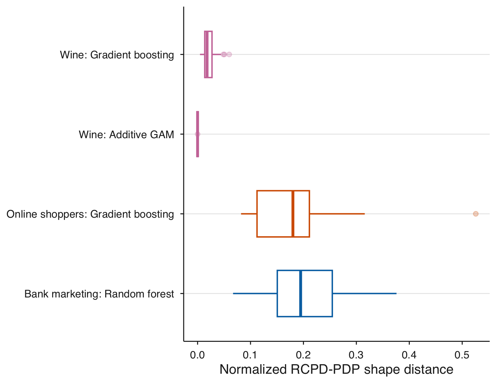{#fig-s-full-split-distance}

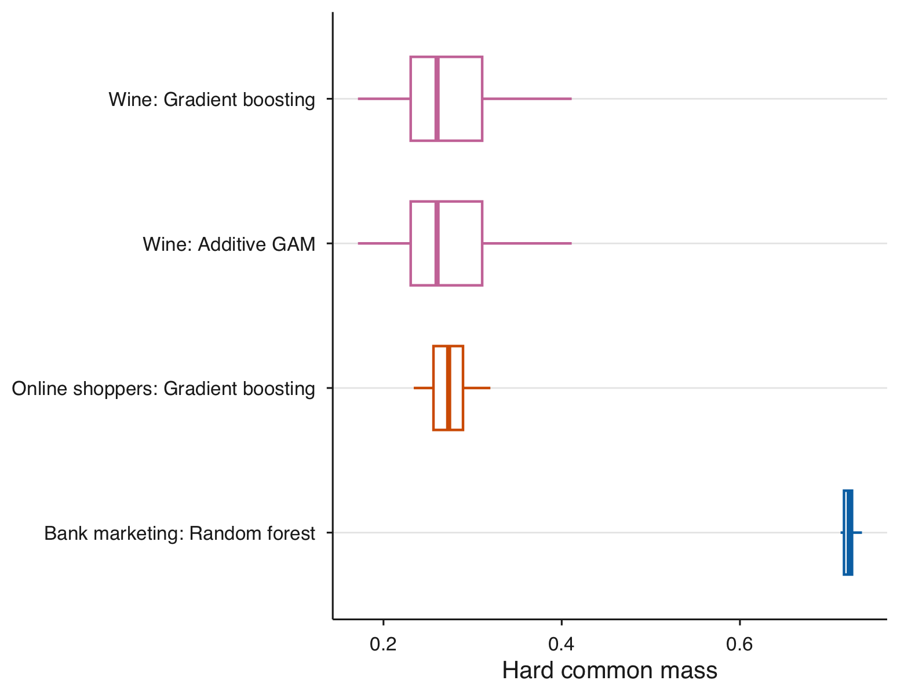{#fig-s-full-split-gamma}

Full-pipeline repeated-split stability. Distances are normalized by the
corresponding centered ordinary-PD amplitude.
:::

```{=latex}
\clearpage
```

## Conditional-subgroup comparator

The conditional-subgroup comparison in @fig-s-conditional-subgroup clarifies why
cs-PDP and RCPD should not be ranked as interchangeable estimators. The CART
partition produces four context populations and therefore four curves. Within
each subgroup's central focal-feature range (thick segments), the curves expose
the common additive response shape with different subgroup compositions.
Outside those ranges the thin segments again require extrapolative queries; for
the two extreme groups, their central ranges do not intersect the declared
global intervention interval. RCPD answers a different question: it seeks one
global population that can be used at every displayed $z$.

::: {#fig-s-conditional-subgroup layout-ncol=2 fig-pos="H"}
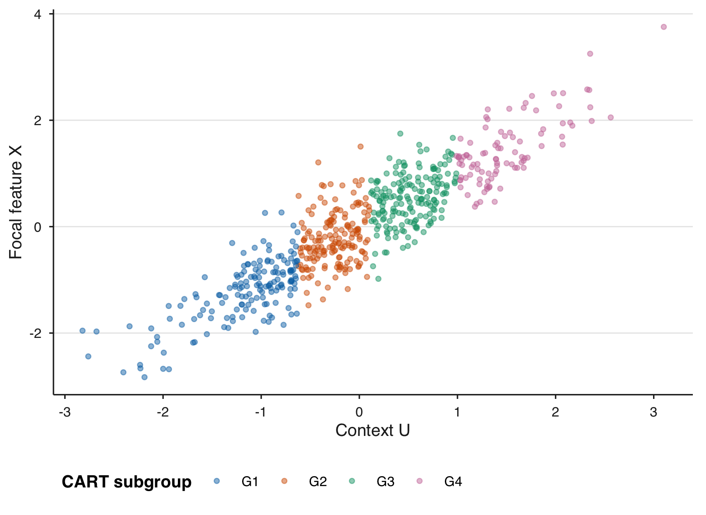{#fig-cs-partition}

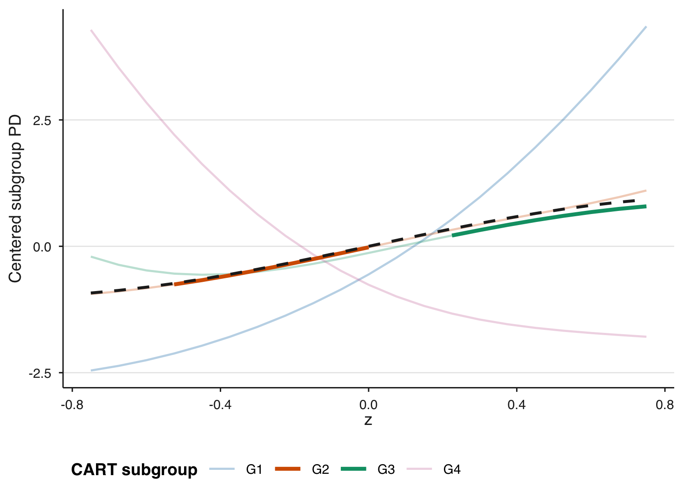{#fig-cs-curves}

Conditional-subgroup-style comparison in the additive composition design.
The comparator intentionally returns several local curves rather than one
global effect.
:::

## Operational workflow

The main article states the estimation protocol; this is its operational form.

1. Predeclare $G$, the score, $\alpha$, candidate tolerances, and diagnostics.
2. Fit $f$ and the validity rule on designated training and calibration data.
3. On projection contexts, form the $m\times K$ validity matrix, check
   feasibility, and fit candidate exponential tilts.
4. On an independent audit split, certify or reject each frozen candidate;
   abstain if none passes.
5. Estimate the selected fixed-reference curve on evaluation contexts and
   report minimum validity, hard common mass, KL, maximum normalized weight,
   and effective sample size with the curve.

Forming the validity matrix costs $O(mK)$ score evaluations. Optimization is
over $K$ dual multipliers, or equivalently over at most $2^K$ observed
validity-pattern cells; in practice only the observed cells are retained.

## Choice of divergence

The relaxed reference is defined by a Kullback--Leibler projection. This
section reports what a different divergence would change, holding the
constraint system, the grid, and the tolerance fixed.

One relation is algebraic and fixes the ceiling. With uniform base weights the
Pearson divergence from $P$ is $n\sum_iw_i^2-1$ and the effective sample size
is $1/\sum_iw_i^2$, so minimising the former is exactly maximising the latter.
The $\chi^2$ projection onto the query-validity constraints is therefore the
effective-sample-size-optimal feasible reference, and no divergence can do
better on that endpoint. It is also the analogue, for this constraint system,
of minimal-dispersion approximately balancing weights [@wang2020]. Comparing
against it thus answers whether the weight concentration reported throughout
is caused by the divergence or by the constraints.

```{r}
#| label: tbl-s-divergence
#| tbl-cap: "Divergence comparison at matched tolerance. Effective fraction is the effective sample size divided by the number of evaluation contexts; support fraction is the share of contexts receiving positive weight. Simulation entries are medians over 200 repetitions per design at $\\sigma=0.45$; California entries are medians over 10 splits at $\\epsilon=0.15$ under both declared validity rules."
#| tbl-pos: H
#| results: asis
divergence_rows <- function(frame, label_columns, labels) {
  data.frame(
    Design = labels,
    Divergence = frame$divergence,
    `Effective fraction` = sprintf("%.4f", frame$median_ess_fraction),
    `Maximum weight` = sprintf("%.1f", frame$median_max_weight),
    `Support fraction` = sprintf("%.3f", frame$median_support_fraction),
    check.names = FALSE, stringsAsFactors = FALSE
  )
}
simulation_part <- s40$summary[s40$summary$sigma == 0.45, ]
california_part <- s40_california$summary[
  s40_california$summary$epsilon == 0.15,
]
divergence_table <- rbind(
  divergence_rows(
    simulation_part, NULL,
    sprintf("Simulation, $\\epsilon=%.2f$", simulation_part$epsilon)
  ),
  divergence_rows(
    california_part, NULL,
    ifelse(california_part$learner == "Locally scaled residual",
           "California, scaled residual", "California, density")
  )
)
knitr::kable(divergence_table, format = "latex", booktabs = TRUE,
             escape = FALSE, align = c("l", "l", "r", "r", "r"),
             row.names = FALSE)
```

The paired contrasts make the size of the gap explicit. They are medians of
the per-repetition ratio, which is the quantity of interest but is not the
ratio of the medians in the table above; the two differ slightly because the
median is not a linear operator. Across the eight
simulation designs the median ratio of $\chi^2$ to KL effective sample size
ranges from
`r fmt(min(s40$contrasts$median_ess_ratio), 3)` to
`r fmt(max(s40$contrasts$median_ess_ratio), 3)`; on the California matrices it
ranges from
`r fmt(min(s40_california$contrasts$median_ess_ratio), 3)` to
`r fmt(max(s40_california$contrasts$median_ess_ratio), 3)`. Mean normalized
shape error and mean off-support sensitivity differ by at most
`r fmt(max(abs(s40$contrasts$mean_shape_error_difference)), 4)` and
`r fmt(max(abs(s40$contrasts$mean_sensitivity_difference)), 4)` respectively,
in both cases marginally favouring $\chi^2$.

Three conclusions follow. The concentration reported in the application is a
consequence of the constraint system rather than of the divergence: the
effective fraction at the application's operating point moves from
`r fmt(s40_california$summary$median_ess_fraction[s40_california$summary$learner == "Locally scaled residual" & s40_california$summary$epsilon == 0.15 & s40_california$summary$divergence == "KL"], 3)`
under KL to
`r fmt(s40_california$summary$median_ess_fraction[s40_california$summary$learner == "Locally scaled residual" & s40_california$summary$epsilon == 0.15 & s40_california$summary$divergence == "Chi-squared"], 3)`
under the optimal choice. A relaxed common reference on these data is expensive
because simultaneous query validity is demanding, and no reweighting scheme can
avoid that. Second, the two projections agree on the curve: the estimand is
insensitive to this modelling decision within the range examined. Third, the
$\chi^2$ solution buys its small advantage by assigning exactly zero weight to
a substantial share of contexts, while the exponential tilt keeps every context
positive. We retain KL because a reference population that silently drops more
than a third of its contexts is harder to report and defend than one that
downweights them.

## Technical results and proofs

### Relaxed common-reference projection

Let $h(U)=(h_1(U),\ldots,h_K(U))$ and let $A$ index the validity patterns
$a\in\{0,1\}^K$ with $p_a=P\{h(U)=a\}>0$. For any $Q\ll P$, write
$q_a=Q\{h(U)=a\}$. The entropy chain rule gives
$$
D_{\mathrm{KL}}(Q\Vert P)
=\sum_{a\in A}q_a\log(q_a/p_a)
+\sum_{a\in A}q_a
D_{\mathrm{KL}}\{Q(\,\cdot\mid h=a)\Vert P(\,\cdot\mid h=a)\}.
$$ {#eq-s-kl-chain}
The validity constraints depend only on $q$. A minimizer therefore preserves
the conditional distribution of $P$ inside every pattern cell and reduces to a
strictly convex finite-dimensional problem on the pattern simplex. Existence
and uniqueness follow from compactness and strict convexity. Under Slater's
condition, strong duality and the Lagrangian first-order condition yield
$q_a\propto p_a\exp(\lambda^\top a)$ and hence the exponential tilt and dual
objective stated in the main article. This is the Fenchel dual of an
$I$-projection under inequality constraints, for which @bhattacharya1995 give
the general equivalence; the constraints here are the validity inequalities
rather than moment equalities, which is precisely the case their formulation
covers. If $P$ is feasible, its zero KL cost is
minimal and unique.

For the hard limit, put $C=\{h_1=\cdots=h_K=1\}$ and
$P_C=P(\,\cdot\mid C)$. The relaxed constraints imply
$$Q_\epsilon^*(C^c)
\leq\sum_{k=1}^KQ_\epsilon^*\{h_k=0\}\leq K\epsilon.$$
The union bound is what makes the limit argument work, but it is loose for
fixed $\epsilon$: at the operating point used in the application, $K=21$ and
$\epsilon=0.15$, the right-hand side exceeds one and the inequality says
nothing. It constrains the limit as $\epsilon\downarrow0$, not the mass of any
particular relaxed solution.
Every limit point as $\epsilon\downarrow0$ is therefore supported on $C$.
Moreover, for any $Q$ supported on $C$,
$$D_{\mathrm{KL}}(Q\Vert P)
=D_{\mathrm{KL}}(Q\Vert P_C)-\log P(C),$$
so $P_C$ is the unique hard minimizer. Lower semicontinuity forces every
relaxed limit point to equal $P_C$. Because $Q_\epsilon^*$ preserves the
conditional distribution of $P$ inside every pattern cell, the convergence in
fact holds in total variation on the full $\sigma$-algebra and not only on the
finite pattern representation.

### Finite-sample audit certificate

For candidate $c$, define
$r_c(U)=\exp\{\lambda_c^\top h(U)-\|\lambda_c\|_1\}$ and target coverage
$\tau$. Its population tilted coverage at grid point $k$ is
$$
\theta_{ck}
=\frac{\mathbb E_P\{r_c(U)h_k(U)\}}
 {\mathbb E_P\{r_c(U)\}}.
$$ {#eq-s-audit-ratio}
The denominator is positive, so $\theta_{ck}\geq\tau$ exactly when
$\mu_{ck}=\mathbb E_P[r_c(U)\{h_k(U)-\tau\}]\geq0$.

If $h_k(U)=1$, then
$r_c(U)\{h_k(U)-\tau\}\leq1-\tau$. If $h_k(U)=0$, then
$$
r_c(U)=\exp\{-\lambda_{ck}-\sum_{j\ne k}
 \lambda_{cj}\{1-h_j(U)\}\}\leq\exp(-\lambda_{ck}),
$$
and the audit variable is at least
$-\tau\exp(-\lambda_{ck})$. Its range width is therefore
$B_{ck}=(1-\tau)+\tau\exp(-\lambda_{ck})$. The empirical Bernstein inequality
[@maurer2009empirical], rescaled to this interval, gives failure probability
at most $\delta/(MK)$ for each candidate--grid pair. A union bound makes all
lower confidence bounds valid simultaneously. On that event, every candidate
whose lower bounds are nonnegative satisfies every population constraint;
selection among such candidates is therefore safe. If no candidate passes,
abstention makes no claim. Applying Hoeffding's inequality to the same bounded
variables gives the alternative certificate used in the simulation.

### Exact continuum reduction for interval rules

Suppose empirical validity has the interval form
$h_z(u_i)=\mathbf 1\{L_i\leq z\leq R_i\}$ on $I=[z_-,z_+]$. Let $B_m$
contain the endpoints of $I$ and all $L_i,R_i$ inside $I$, and let $T_m$
contain one point in every open cell between consecutive distinct elements of
$B_m$. Then, for every probability vector $w$,
$$
\inf_{z\in I}\sum_{i=1}^m w_i h_z(u_i)
=\min_{z\in T_m}\sum_{i=1}^m w_i h_z(u_i).
$$ {#eq-s-critical-cells}
Indeed, the complete validity vector is constant on every open cell. At a
breakpoint, closed intervals may add valid rows relative to adjacent one-sided
patterns but cannot remove a row valid on either side; a breakpoint cannot
lower weighted coverage. Thus the empirical continuum projection is an exact
finite convex program. An exchange algorithm that repeatedly adds the worst
violated cell terminates after at most $|T_m|$ additions. A row is valid over
the whole interval exactly when $L_i\leq z_-$ and $R_i\geq z_+$, so hard
common support depends only on the endpoints.

At population level, assume
$P\{L=z\}=P\{R=z\}=0$ for every $z\in I$. Endpoint crossings then show that
$z\mapsto h_z$ is continuous in $L_1(P)$; its image of compact $I$ is compact.
This supplies the compact moment class required by continuum I-projection
theory [@tabri2025]. The same argument applies to a fixed finite union of
intervals after collecting all component endpoints.

### Empirical projection and active-set inference

Let $\mathcal A$ be the positive-probability validity patterns with masses
$p=(p_a)$. For fixed $K$ and tolerance strictly inside a Slater interval, the
population problem minimizes
$\sum_aq_a\log(q_a/p_a)$ over a compact simplex with linear inequalities.
The empirical pattern masses satisfy
$$
\sqrt m(\widehat p-p)
\rightsquigarrow N\{0,\operatorname{diag}(p)-pp^\top\}.
$$
Continuity and uniqueness of the finite-dimensional minimizer yield
$\widehat q^*\to q^*$ in $\ell_1$. If the dual solution is unique,
$\widehat\lambda\to\lambda^*$. Under linear independence of the active
constraints and strict complementarity, the KKT Jacobian is locally
nonsingular; perturbation analysis [@bonnans2000] and the delta method give
root-$m$ asymptotic normality of multipliers, projected pattern masses, and
pointwise RCPD. Without strict complementarity, active-set changes leave the
map only directionally differentiable, so an ordinary bootstrap need not be
valid [@fang2019].

For pattern-specific conditional prediction means
$\mu_a(z)=\mathbb E[f(z,U)\mid h(U)=a]$, an influence-function representation is
$$
\phi_z(U)=\sum_{a\in\mathcal A}\mu_a(z)
D_pq_a^*[e_{h(U)}-p]
+\frac{q_{h(U)}^*}{p_{h(U)}}\{f(z,U)-\mu_{h(U)}(z)\}.
$$ {#eq-s-projection-if}
The first term is projection-weight variation and the second is within-cell
averaging variation. This result is local: rare cells, concentrated weights,
or an active-set transition can make the inverse KKT Jacobian unstable.

### Identification and plug-in sensitivity

For fixed $z$, let $S=\{u:(z,u)\in\mathcal V\}$ and suppose accepted-query
predictions are $L_f$-Lipschitz under a declared context metric $d$. The sharp
bounded Lipschitz extensions at an unaccepted $u$ are
$$
\underline f(z,u)=\max\{y_-,\sup_{v\in S}[f(z,v)-L_fd(u,v)]\},
\qquad
\overline f(z,u)=\min\{y_+,\inf_{v\in S}[f(z,v)+L_fd(u,v)]\}.
$$ {#eq-s-lipschitz-envelope}
McShane's extension argument [@mcshane1934] shows that every admissible
extension lies between these envelopes and that both endpoints are attainable.
Integrating them therefore gives sharp bounds for ordinary PD. Their width is
at most
$$
\mathbb E_P\!\left[
\mathbf 1\{U\notin S\}
\min\{y_+-y_-,2L_fd(U,S)\}
\right].
$$ {#eq-s-lipschitz-width}

Finally, if a learned validity rule is independent of $m$ evaluation contexts
and disagrees with its population counterpart with maximum grid-wise
probability $d_G$, Hoeffding's inequality and a union bound give
$$
\max_{z\in G}|\widehat{\operatorname{ISC}}^P_j(z)
-\operatorname{ISC}^P_j(z)|
\leq \sqrt{\frac{\log(2|G|/\eta)}{2m}}+d_G
$$
with conditional probability at least $1-\eta$. This decomposition exposes
validity-learning error but does not estimate it from the evaluation sample.

## Reproducibility

The supplement uses the same `renv.lock`, fixed seeds, result objects, and
`targets` pipeline as the main article. The accompanying curated artifact maps
all panels removed from this compact PDF to their generating targets in
`results/extended-results-index.md`. Internal drafts, caches, exploratory code,
and the local literature archive are not part of the public artifact; data
acquisition instructions and redistribution conditions are retained.
